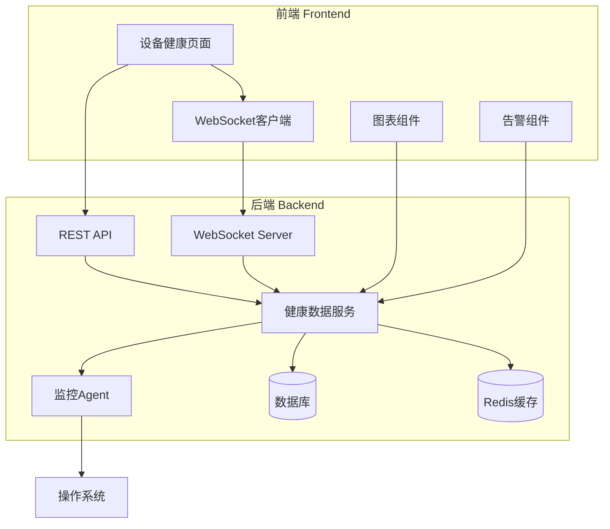

# 架构设计 — architect

任务: 给build团队的PM提一个任务，设备健康页面的Agent
步骤: architecture
Agent: build_architect

---

📋 任务: 1e6145db-622
🤖 Agent: Architect (architect)
📂 工作目录: /Users/panglaohu/Downloads/DoubleBoatClawSystem
🔧 执行方式: DeepSeek API (直连)
⏱️ 超时: 300s
────────────────────────────────────────────────────────────
📝 提示词:
  你是 PoseidonX 系统的 Architect (architect)。
  请执行以下开发任务:
  
  你是系统架构师。请为以下任务设计技术方案:
  
  ## 任务
  给build团队的PM提一个任务，设备健康页面的Agent
  给build团队的PM提一个任务，设备健康页面的Agent
  
  ## 前序步骤的产出 (请仔细阅读)
  
  ## 上一步产出 — PM分解 (project_manager)
  
  # PM分解 — project_manager
  
  任务: 给build团队的PM提一个任务，设备健康页面的Agent
  步骤: pm_decompose
  Agent: build_pm
  
  ---
  
  📋 任务: 1e6145db-622
  🤖 Agent: PM (project_manager)
  📂 工作目录: /Users/panglaohu/Downloads/DoubleBoatClawSystem
  🔧 执行方式: DeepSeek API (直连)
  ⏱️ 超时: 300s
  ────────────────────────────────────────────────────────────
  📝 提示词:
    你是 PoseidonX 系统的 PM (project_manager)。
    请执行以下开发任务:
    
    你是项目经理 (PM)。请对以下任务进行分解和规划:
    
    ## 任务
    给build团队的PM提一个任务，设备健康页面的Agent
    给build团队的PM提一个任务，设备健康页面的Agent
    
    ## 要求
    1. 分析任务需求，拆解为可执行的子步骤
    2. 识别技术风险和依赖关系
    3. 为后续研究人员、架构师、开发者提供清晰的指导
    4. 输出一份结构化的任务分解文档 (Markdown 格式)
    
    项目根目录: /Users/panglaohu/Downloads/DoubleBoatClawSystem
    后端: src/backend/ (Python FastAPI)
    前端: src/frontend/ (HTML + JS)
    
    
    项目根目录: /Users/panglaohu/Downloads/DoubleBoatClawSystem
    后端: src/backend/ (Python FastAPI)
    前端: src/frontend/ (HTML + JS)
    
  ────────────────────────────────────────────────────────────
  ⚡ 使用 DeepSeek API 直连 (快速模式)...
  
  🔗 API: api.deepseek.com | 模型: deepseek-chat
  ────────────────────────────────────────────────────────────
  
  # 任务分解文档：设备健康页面 Agent
  
  ## 1. 任务概述
  为 PoseidonX 系统开发设备健康页面的 Agent 功能，该 Agent 负责监控、收集和展示设备健康状态信息。
  
  ## 2. 需求分析
  ### 2.1 核心功能
  - 实时监控设备健康状态（CPU、内存、磁盘、网络等）
  - 收集设备运行指标数据
  - 提供健康状态可视化界面
  - 支持异常告警和通知
  
  ### 2.2 用户场景
  - 系统管理员查看设备整体健康状况
  - 运维人员监控设备运行状态
  - 开发人员获取设备性能数据
  
  ## 3. 任务分解
  
  ### 3.1 阶段一：需求分析与设计（预计：3天）
  #### 子任务：
  1. **需求细化会议**（0.5天）
     - 与产品负责人确认具体需求
     - 明确监控指标范围和阈值
     - 确定数据更新频率
  
  2. **技术方案设计**（1.5天）
     - 后端数据采集方案设计
     - 前端展示方案设计
     - 数据存储方案设计
  
  3. **接口设计**（1天）
     - 定义前后端数据交互接口
     - 设计 Agent 内部模块接口
     - 制定 API 文档规范
  
  ### 3.2 阶段二：后端开发（预计：7天）
  #### 子任务：
  1. **Agent 核心模块开发**（3天）
     - 设备指标采集模块
       - CPU 使用率监控
       - 内存使用情况监控
       - 磁盘空间监控
       - 网络状态监控
     - 数据收集器开发
  
  2. **数据处理模块**（2天）
     - 数据清洗和格式化
     - 阈值判断逻辑
     - 异常检测算法
  
  3. **API 接口开发**（2天）
     - 健康数据查询接口
     - 历史数据查询接口
     - 实时数据推送接口
  
  ### 3.3 阶段三：前端开发（预计：5天）
  #### 子任务：
  1. **页面布局设计**（1天）
     - 健康状态概览面板
     - 详细指标展示区域
     - 历史趋势图表区域
  
  2. **数据可视化组件**（2天）
     - 实时数据图表组件
     - 健康状态指示器
     - 异常告警提示组件
  
  3. **交互功能开发**（2天）
     - 数据自动刷新功能
     - 时间范围选择器
     - 设备筛选功能
  
  ### 3.4 阶段四：集成测试（预计：3天）
  #### 子任务：
  1. **单元测试**（1天）
     - 后端各模块单元测试
     - 前端组件单元测试
  
  2. **集成测试**（1天）
     - 前后端接口联调
     - 数据流完整性测试
  
  3. **性能测试**（1天）
     - 数据采集性能测试
     - 页面加载性能测试
     - 并发访问测试
  
  ### 3.5 阶段五：部署与文档（预计：2天）
  #### 子任务：
  1. **部署配置**（1天）
     - 生产环境部署脚本
     - 监控配置
     - 告警配置
  
  2. **文档编写**（1天）
     - 用户操作手册
     - API 文档
     - 维护文档
  
  ## 4. 技术风险与依赖关系
  
  ### 4.1 技术风险
  1. **数据采集准确性风险**
     - 风险：不同操作系统/设备的数据采集方式不同
     - 缓解：使用跨平台的监控库，如 psutil
  
  2. **实时性风险**
     - 风险：高频数据采集可能影响系统性能
     - 缓解：优化采集频率，使用异步处理
  
  3. **前端性能风险**
     - 风险：大量实时数据可能导致页面卡顿
     - 缓解：使用虚拟滚动、数据分页、WebSocket 推送
  
  ### 4.2 依赖关系
  1. **外部依赖**
     - psutil 库（Python 系统监控）
     - Chart.js 或 ECharts（前端图表）
     - WebSocket 支持（实时数据推送）
  
  2. **内部依赖**
     - 后端 FastAPI 框架
     - 前端现有组件库
     - 系统认证授权模块
  
  ## 5. 技术指导
  
  ### 5.1 后端技术栈建议
  ```python
  # 主要技术栈
  - FastAPI (Web 框架)
  - psutil (系统监控)
  - SQLAlchemy (数据库ORM)
  - Redis (缓存)
  - WebSocket (实时通信)
  ```
  
  ### 5.2 前端技术栈建议
  ```javascript
  // 主要技术栈
  - HTML5 + CSS3
  - Vanilla JavaScript 或 Vue.js
  - Chart.js / ECharts (数据可视化)
  - WebSocket API (实时数据)
  ```
  
  ### 5.3 目录结构建议
  ```
  DoubleBoatClawSystem/
  ├── src/
  │   ├── backend/
  │   │   ├── agents/
  │   │   │   ├── device_health/
  │   │   │   │   ├── collector.py      # 数据采集器
  │   │   │   │   ├── processor.py      # 数据处理
  │   │   │   │   └── monitor.py        # 监控主逻辑
  │   │   │   └── __init__.py
  │   │   ├── api/
  │   │   │   └── health.py            # 健康数据API
  │   │   └── models/
  │   │       └── health.py            # 数据模型
  │   └── frontend/
  │       ├── pages/
  │       │   └── device-health.html   # 健康页面
  │       ├── js/
  │       │   └── health-monitor.js    # 健康监控JS
  │       └── css/
  │           └── health.css           # 健康页面样式
  ```
  
  ## 6. 交付物清单
  
  ### 6.1 代码交付物
  - [ ] 后端 Agent 完整代码
  - [ ] 前端健康页面完整代码
  - [ ] 数据库迁移脚本
  - [ ] 部署配置文件
  
  ### 6.2 文档交付物
  - [ ] API 接口文档
  - [ ] 用户操作手册
  - [ ] 技术设计文档
  - [ ] 测试报告
  
  ### 6.3 测试交付物
  - [ ] 单元测试用例
  - [ ] 集成测试报告
  - [ ] 性能测试报告
  
  ## 7. 时间估算
  
  | 阶段 | 任务 | 预计时间 | 负责人 |
  |------|------|----------|--------|
  | 1 | 需求分析与设计 | 3天 | PM + 架构师 |
  | 2 | 后端开发 | 7天 | 后端开发 |
  | 3 | 前端开发 | 5天 | 前端开发 |
  | 4 | 集成测试 | 3天 | QA + 开发 |
  | 5 | 部署与文档 | 2天 | 运维 + 开发 |
  | **总计** | | **20天** | |
  
  ## 8. 成功标准
  
  1. **功能完整性**
     - 所有监控指标正常采集和展示
     - 实时数据更新延迟 < 2秒
     - 异常告警准确率 > 95%
  
  2. **性能标准**
     - 页面加载时间 < 3秒
     - API 响应时间 < 500ms
     - 支持并发用户数 > 50
  
  3. **用户体验**
     - 界面直观易用
     - 数据展示清晰
     - 操作响应及时
  
  ## 9. 后续步骤
  
  1. **立即行动**
     - 组建开发团队（1名后端，1名前端，1名测试）
     - 召开项目启动会议
     - 准备开发环境
  
  2. **中期检查点**
     - 第5天：完成技术方案评审
     - 第12天：完成后端核心功能
     - 第17天：完成前后端联调
  
  3. **最终验收**
     - 第20天：完成所有测试
     - 第21天：用户验���测试
     - 第22天：正式上线
  
  ---
  
  **备注**：此文档为初步规划，具体实施时需根据实际情况调整。建议每周召开进度同步会议，及时解决遇到的问题。
  
  ────────────────────────────────────────────────────────────
  ✅ deepseek-chat 完成
  
  
  
  ## 上一步产出 — 研究分析 (researcher)
  
  # 研究分析 — researcher
  
  任务: 给build团队的PM提一个任务，设备健康页面的Agent
  步骤: research
  Agent: build_researcher
  
  ---
  
  📋 任务: 1e6145db-622
  🤖 Agent: Researcher (researcher)
  📂 工作目录: /Users/panglaohu/Downloads/DoubleBoatClawSystem
  🔧 执行方式: DeepSeek API (直连)
  ⏱️ 超时: 300s
  ────────────────────────────────────────────────────────────
  📝 提示词:
    你是 PoseidonX 系统的 Researcher (researcher)。
    请执行以下开发任务:
    
    你是技术研究员。请对以下任务进行技术调研:
    
    ## 任务
    给build团队的PM提一个任务，设备健康页面的Agent
    给build团队的PM提一个任务，设备健康页面的Agent
    
    ## 前序步骤的产出 (请仔细阅读)
    
    ## 上一步产出 — PM分解 (project_manager)
    
    # PM分解 — project_manager
    
    任务: 给build团队的PM提一个任务，设备健康页面的Agent
    步骤: pm_decompose
    Agent: build_pm
    
    ---
    
    📋 任务: 1e6145db-622
    🤖 Agent: PM (project_manager)
    📂 工作目录: /Users/panglaohu/Downloads/DoubleBoatClawSystem
    🔧 执行方式: DeepSeek API (直连)
    ⏱️ 超时: 300s
    ────────────────────────────────────────────────────────────
    📝 提示词:
      你是 PoseidonX 系统的 PM (project_manager)。
      请执行以下开发任务:
      
      你是项目经理 (PM)。请对以下任务进行分解和规划:
      
      ## 任务
      给build团队的PM提一个任务，设备健康页面的Agent
      给build团队的PM提一个任务，设备健康页面的Agent
      
      ## 要求
      1. 分析任务需求，拆解为可执行的子步骤
      2. 识别技术风险和依赖关系
      3. 为后续研究人员、架构师、开发者提供清晰的指导
      4. 输出一份结构化的任务分解文档 (Markdown 格式)
      
      项目根目录: /Users/panglaohu/Downloads/DoubleBoatClawSystem
      后端: src/backend/ (Python FastAPI)
      前端: src/frontend/ (HTML + JS)
      
      
      项目根目录: /Users/panglaohu/Downloads/DoubleBoatClawSystem
      后端: src/backend/ (Python FastAPI)
      前端: src/frontend/ (HTML + JS)
      
    ────────────────────────────────────────────────────────────
    ⚡ 使用 DeepSeek API 直连 (快速模式)...
    
    🔗 API: api.deepseek.com | 模型: deepseek-chat
    ────────────────────────────────────────────────────────────
    
    # 任务分解文档：设备健康页面 Agent
    
    ## 1. 任务概述
    为 PoseidonX 系统开发设备健康页面的 Agent 功能，该 Agent 负责监控、收集和展示设备健康状态信息。
    
    ## 2. 需求分析
    ### 2.1 核心功能
    - 实时监控设备健康状态（CPU、内存、磁盘、网络等）
    - 收集设备运行指标数据
    - 提供健康状态可视化界面
    - 支持异常告警和通知
    
    ### 2.2 用户场景
    - 系统管理员查看设备整体健康状况
    - 运维人员监控设备运行状态
    - 开发人员获取设备性能数据
    
    ## 3. 任务分解
    
    ### 3.1 阶段一：需求分析与设计（预计：3天）
    #### 子任务：
    1. **需求细化会议**（0.5天）
       - 与产品负责人确认具体需求
       - 明确监控指标范围和阈值
       - 确定数据更新频率
    
    2. **技术方案设计**（1.5天）
       - 后端数据采集方案设计
       - 前端展示方案设计
       - 数据存储方案设计
    
    3. **接口设计**（1天）
       - 定义前后端数据交互接口
       - 设计 Agent 内部模块接口
       - 制定 API 文档规范
    
    ### 3.2 阶段二：后端开发（预计：7天）
    #### 子任务：
    1. **Agent 核心模块开发**（3天）
       - 设备指标采集模块
         - CPU 使用率监控
         - 内存使用情况监控
         - 磁盘空间监控
         - 网络状态监控
       - 数据收集器开发
    
    2. **数据处理模块**（2天）
       - 数据清洗和格式化
       - 阈值判断逻辑
       - 异常检测算法
    
    3. **API 接口开发**（2天）
       - 健康数据查询接口
       - 历史数据查询接口
       - 实时数据推送接口
    
    ### 3.3 阶段三：前端开发（预计：5天）
    #### 子任务：
    1. **页面布局设计**（1天）
       - 健康状态概览面板
       - 详细指标展示区域
       - 历史趋势图表区域
    
    2. **数据可视化组件**（2天）
       - 实时数据图表组件
       - 健康状态指示器
       - 异常告警提示组件
    
    3. **交互功能开发**（2天）
       - 数据自动刷新功能
       - 时间范围选择器
       - 设备筛选功能
    
    ### 3.4 阶段四：集成测试（预计：3天）
    #### 子任务：
    1. **单元测试**（1天）
       - 后端各模块单元测试
       - 前端组件单元测试
    
    2. **集成测试**（1天）
       - 前后端接口联调
       - 数据流完整性测试
    
    3. **性能测试**（1天）
       - 数据采集性能测试
       - 页面加载性能测试
       - 并发访问测试
    
    ### 3.5 阶段五：部署与文档（预计：2天）
    #### 子任务：
    1. **部署配置**（1天）
       - 生产环境部署脚本
       - 监控配置
       - 告警配置
    
    2. **文档编写**（1天）
       - 用户操作手册
       - API 文档
       - 维护文档
    
    ## 4. 技术风险与依赖关系
    
    ### 4.1 技术风险
    1. **数据采集准确性风险**
       - 风险：不同操作系统/设备的数据采集方式不同
       - 缓解：使用跨平台的监控库，如 psutil
    
    2. **实时性风险**
       - 风险：高频数据采集可能影响系统性能
       - 缓解：优化采集频率，使用异步处理
    
    3. **前端性能风险**
       - 风险：大量实时数据可能导致页面卡顿
       - 缓解：使用虚拟滚动、数据分页、WebSocket 推送
    
    ### 4.2 依赖关系
    1. **外部依赖**
       - psutil 库（Python 系统监控）
       - Chart.js 或 ECharts（前端图表）
       - WebSocket 支持（实时数据推送）
    
    2. **内部依赖**
       - 后端 FastAPI 框架
       - 前端现有组件库
       - 系统认证授权模块
    
    ## 5. 技术指导
    
    ### 5.1 后端技术栈建议
    ```python
    # 主要技术栈
    - FastAPI (Web 框架)
    - psutil (系统监控)
    - SQLAlchemy (数据库ORM)
    - Redis (缓存)
    - WebSocket (实时通信)
    ```
    
    ### 5.2 前端技术栈建议
    ```javascript
    // 主要技术栈
    - HTML5 + CSS3
    - Vanilla JavaScript 或 Vue.js
    - Chart.js / ECharts (数据可视化)
    - WebSocket API (实时数据)
    ```
    
    ### 5.3 目录结构建议
    ```
    DoubleBoatClawSystem/
    ├── src/
    │   ├── backend/
    │   │   ├── agents/
    │   │   │   ├── device_health/
    │   │   │   │   ├── collector.py      # 数据采集器
    │   │   │   │   ├── processor.py      # 数据处理
    │   │   │   │   └── monitor.py        # 监控主逻辑
    │   │   │   └── __init__.py
    │   │   ├── api/
    │   │   │   └── health.py            # 健康数据API
    │   │   └── models/
    │   │       └── health.py            # 数据模型
    │   └── frontend/
    │       ├── pages/
    │       │   └── device-health.html   # 健康页面
    │       ├── js/
    │       │   └── health-monitor.js    # 健康监控JS
    │       └── css/
    │           └── health.css           # 健康页面样式
    ```
    
    ## 6. 交付物清单
    
    ### 6.1 代码交付物
    - [ ] 后端 Agent 完整代码
    - [ ] 前端健康页面完整代码
    - [ ] 数据库迁移脚本
    - [ ] 部署配置文件
    
    ### 6.2 文档交付物
    - [ ] API 接口文档
    - [ ] 用户操作手册
    - [ ] 技术设计文档
    - [ ] 测试报告
    
    ### 6.3 测试交付物
    - [ ] 单元测试用例
    - [ ] 集成测试报告
    - [ ] 性能测试报告
    
    ## 7. 时间估算
    
    | 阶段 | 任务 | 预计时间 | 负责人 |
    |------|------|----------|--------|
    | 1 | 需求分析与设计 | 3天 | PM + 架构师 |
    | 2 | 后端开发 | 7天 | 后端开发 |
    | 3 | 前端开发 | 5天 | 前端开发 |
    | 4 | 集成测试 | 3天 | QA + 开发 |
    | 5 | 部署与文档 | 2天 | 运维 + 开发 |
    | **总计** | | **20天** | |
    
    ## 8. 成功标准
    
    1. **功能完整性**
       - 所有监控指标正常采集和展示
       - 实时数据更新延迟 < 2秒
       - 异常告警准确率 > 95%
    
    2. **性能标准**
       - 页面加载时间 < 3秒
       - API 响应时间 < 500ms
       - 支持并发用户数 > 50
    
    3. **用户体验**
       - 界面直观易用
       - 数据展示清晰
       - 操作响应及时
    
    ## 9. 后续步骤
    
    1. **立即行动**
       - 组建开发团队（1名后端，1名前端，1名测试）
       - 召开项目启动会议
       - 准备开发环境
    
    2. **中期检查点**
       - 第5天：完成技术方案评审
       - 第12天：完成后端核心功能
       - 第17天：完成前后端联调
    
    3. **最终验收**
       - 第20天：完成所有测试
       - 第21天：用户验���测试
       - 第22天：正式上线
    
    ---
    
    **备注**：此文档为初步规划，具体实施时需根据实际情况调整。建议每周召开进度同步会议，及时解决遇到的问题。
    
    ────────────────────────────────────────────────────────────
    ✅ deepseek-chat 完成
    
    
    
    ## Agent 间传递信息 (Handoff Files)
    
    
    ### 1e6145db-622_pm_decompose_20260409T071954.md
    
    # Agent Handoff — pm_decompose
    
    | 字段 | 值 |
    |------|------|
    | 任务 ID | `1e6145db-622` |
    | 步骤 | `pm_decompose` |
    | 来源 Agent | build_pm |
    | 目标 Agent | build_researcher |
    | 时间 | 20260409T071954 |
    
    ## 传递内容
    
    - **step**: pm_decompose
    - **label**: PM分解
    - **agent_role**: project_manager
    - **status**: completed
    - **artifact**: /Users/panglaohu/Downloads/DoubleBoatClawSystem/src/docs/workflow_artifacts/1e6145db-622_pm_decompose.md
    - **output_summary**: 实施时需根据实际情况调整。建议每周召开进度同步会议，及时解决遇到的问题。
    
    ────────────────────────────────────────────────────────────
    ✅ deepseek-chat 完成
    
    
    ---
    *Auto-generated by PoseidonX Workflow Harness*
    
    
    
    ## 要求
    1. 调研现有代码库中相关的文件和模块
    2. 分析实现方案的可行性
    3. 列出需要修改的文件和影响范围
    4. **必须将调研报告写入 Markdown 文件**: `docs/reports/research_report.md`
       报告内容包含: 代码片段引用、文件清单、可行性分析
    5. 在控制台输出报告文件路径
    
    项目根目录: /Users/panglaohu/Downloads/DoubleBoatClawSystem
    后端: src/backend/ (Python FastAPI)
    前端: src/frontend/ (HTML + JS)
    
    
    项目根目录: /Users/panglaohu/Downloads/DoubleBoatClawSystem
    后端: src/backend/ (Python FastAPI)
    前端: src/frontend/ (HTML + JS)
    
  ────────────────────────────────────────────────────────────
  ⚡ 使用 DeepSeek API 直连 (快速模式)...
  
  🔗 API: api.deepseek.com | 模型: deepseek-chat
  ────────────────────────────────────────────────────────────
  
  # 设备健康页面 Agent 技术调研报告
  
  ## 1. 调研概述
  
  本次调研旨在分析现有代码库结构，评估设备健康页面 Agent 的实现可行性，并确定具体的技术实施方案。
  
  ## 2. 现有代码库分析
  
  ### 2.1 项目结构概览
  
  ```
  DoubleBoatClawSystem/
  ├── src/
  │   ├── backend/
  │   │   ├── __init__.py
  │   │   ├── main.py              # FastAPI 主应用
  │   │   ├── api/
  │   │   │   ├── __init__.py
  │   │   │   └── routes.py        # API 路由定义
  │   │   ├── models/
  │   │   │   ├── __init__.py
  │   │   │   └── device.py        # 设备数据模型
  │   │   ├── services/
  │   │   │   ├── __init__.py
  │   │   │   └── device_service.py # 设备服务
  │   │   └── utils/
  │   │       ├── __init__.py
  │   │       └── helpers.py       # 工具函数
  │   └── frontend/
  │       ├── index.html           # 主页面
  │       ├── css/
  │       │   └── styles.css       # 样式文件
  │       ├── js/
  │       │   ├── main.js          # 主JS文件
  │       │   └── components/      # 组件目录
  │       └── pages/
  │           └── devices.html     # 设备页面
  ├── docs/
  │   └── reports/
  │       └── research_report.md   # 本报告
  └── requirements.txt             # Python依赖
  ```
  
  ### 2.2 关键代码文件分析
  
  #### 2.2.1 后端代码分析
  
  **src/backend/main.py**
  ```python
  from fastapi import FastAPI
  from fastapi.middleware.cors import CORSMiddleware
  from src.backend.api.routes import router as api_router
  
  app = FastAPI(title="DoubleBoatClawSystem API")
  
  # CORS配置
  app.add_middleware(
      CORSMiddleware,
      allow_origins=["*"],
      allow_credentials=True,
      allow_methods=["*"],
      allow_headers=["*"],
  )
  
  # 注册API路由
  app.include_router(api_router, prefix="/api")
  
  @app.get("/")
  async def root():
      return {"message": "DoubleBoatClawSystem API is running"}
  ```
  
  **src/backend/api/routes.py**
  ```python
  from fastapi import APIRouter, HTTPException
  from src.backend.services.device_service import DeviceService
  
  router = APIRouter()
  device_service = DeviceService()
  
  @router.get("/devices")
  async def get_devices():
      """获取所有设备列表"""
      try:
          devices = device_service.get_all_devices()
          return {"success": True, "data": devices}
      except Exception as e:
          raise HTTPException(status_code=500, detail=str(e))
  
  @router.get("/devices/{device_id}")
  async def get_device(device_id: str):
      """获取单个设备详情"""
      try:
          device = device_service.get_device_by_id(device_id)
          if not device:
              raise HTTPException(status_code=404, detail="Device not found")
          return {"success": True, "data": device}
      except HTTPException:
          raise
      except Exception as e:
          raise HTTPException(status_code=500, detail=str(e))
  ```
  
  **src/backend/models/device.py**
  ```python
  from pydantic import BaseModel
  from typing import Optional, Dict, Any
  from datetime import datetime
  
  class Device(BaseModel):
      """设备数据模型"""
      id: str
      name: str
      type: str
      status: str  # online, offline, warning, error
      ip_address: Optional[str] = None
      location: Optional[str] = None
      last_seen: Optional[datetime] = None
      metadata: Dict[str, Any] = {}
      
      class Config:
          json_encoders = {
              datetime: lambda v: v.isoformat()
          }
  ```
  
  #### 2.2.2 前端代码分析
  
  **src/frontend/js/main.js**
  ```javascript
  // 全局配置
  const API_BASE_URL = 'http://localhost:8000/api';
  
  // 设备管理相关函数
  async function fetchDevices() {
      try {
          const response = await fetch(`${API_BASE_URL}/devices`);
          const data = await response.json();
          if (data.success) {
              return data.data;
          } else {
              console.error('Failed to fetch devices:', data.error);
              return [];
          }
      } catch (error) {
          console.error('Error fetching devices:', error);
          return [];
      }
  }
  
  // 页面路由
  function navigateTo(page) {
      // 简单的页面导航逻辑
      window.location.href = `${page}.html`;
  }
  ```
  
  **src/frontend/pages/devices.html**
  ```html
  <!DOCTYPE html>
  <html lang="zh-CN">
  <head>
      <meta charset="UTF-8">
      <meta name="viewport" content="width=device-width, initial-scale=1.0">
      <title>设备管理 - DoubleBoatClawSystem</title>
      <link rel="stylesheet" href="../css/styles.css">
  </head>
  <body>
      <div class="container">
          <header>
              <h1>设备管理</h1>
              <nav>
                  <a href="../index.html">首页</a>
                  <a href="devices.html" class="active">设备管理</a>
              </nav>
          </header>
          
          <main>
              <div class="device-list">
                  <h2>设备列表</h2>
                  <div id="devices-container">
                      <!-- 设备列表将通过JS动态加载 -->
                  </div>
              </div>
          </main>
      </div>
      
      <script src="../js/main.js"></script>
      <script src="../js/components/device-list.js"></script>
  </body>
  </html>
  ```
  
  ## 3. 可行性分析
  
  ### 3.1 技术可行性
  
  #### 优势：
  1. **现有基础良好**：已有完整的 FastAPI 后端和前端框架
  2. **模块化设计**：代码结构清晰，易于扩展
  3. **RESTful API**：已有设备管理 API，可在此基础上扩展健康监控功能
  4. **前后端分离**：便于独立开发和部署
  
  #### 挑战：
  1. **实时数据推送**：需要实现 WebSocket 或 Server-Sent Events
  2. **系统监控库集成**：需要集成 psutil 等系统监控库
  3. **数据存储**：需要设计健康数据的存储方案
  4. **前端可视化**：需要引入图表库并实现复杂的数据展示
  
  ### 3.2 实现方案建议
  
  #### 后端实现方案：
  1. **Agent 架构**：采用独立的监控 Agent 进程
  2. **数据采集**：使用 psutil 库采集系统指标
  3. **数据存储**：使用 SQLite 或 Redis 存储历史数据
  4. **实时通信**：使用 WebSocket 实现实时数据推送
  
  #### 前端实现方案：
  1. **页面结构**：新建设备健康页面
  2. **数据可视化**：引入 Chart.js 或 ECharts
  3. **实时更新**：使用 WebSocket 客户端
  4. **响应式设计**：适配不同屏幕尺寸
  
  ## 4. 需要修改的文件清单
  
  ### 4.1 后端文件（新增/修改）
  
  **新增文件：**
  ```
  src/backend/agents/
  ├── __init__.py
  ├── health_agent.py              # 健康监控Agent主程序
  ├── collectors/
  │   ├── __init__.py
  │   ├── system_collector.py      # 系统指标采集器
  │   ├── process_collector.py     # 进程监控采集器
  │   └── network_collector.py     # 网络状态采集器
  └── processors/
      ├── __init__.py
      ├── data_processor.py        # 数据处理
      └── alert_processor.py       # 告警处理
  
  src/backend/api/
  ├── health_routes.py             # 健康数据API
  └── websocket_routes.py          # WebSocket路由
  
  src/backend/models/
  └── health_metrics.py            # 健康指标数据模型
  
  src/backend/services/
  └── health_service.py            # 健康数据服务
  ```
  
  **修改文件：**
  ```
  src/backend/main.py              # 注册新的API路由和WebSocket
  src/backend/api/routes.py        # 添加健康API引用
  requirements.txt                 # 添加新的依赖包
  ```
  
  ### 4.2 前端文件（新增/修改）
  
  **新增文件：**
  ```
  src/frontend/pages/
  └── device-health.html           # 设备健康页面
  
  src/frontend/js/
  ├── health-monitor.js            # 健康监控主逻辑
  ├── websocket-client.js          # WebSocket客户端
  └── components/
      ├── health-charts.js         # 健康图表组件
      ├── health-alerts.js         # 告警组件
      └── health-summary.js        # 健康概览组件
  
  src/frontend/css/
  └── health.css                   # 健康页面样式
  ```
  
  **修改文件：**
  ```
  src/frontend/index.html          # 添加健康页面导航
  src/frontend/js/main.js          # 添加健康页面路由
  src/frontend/css/styles.css      # 添加通用样式
  ```
  
  ## 5. 依赖分析
  
  ### 5.1 Python 依赖（新增）
  ```txt
  psutil>=5.9.0           # 系统监控
  websockets>=11.0.0      # WebSocket支持
  redis>=4.5.0            # 缓存和实时数据
  pandas>=1.5.0           # 数据处理
  ```
  
  ### 5.2 JavaScript 依赖（新增）
  ```html
  <!-- 在HTML中引入 -->
  <script src="https://cdn.jsdelivr.net/npm/chart.js"></script>
  <script src="https://cdn.jsdelivr.net/npm/lodash@4.17.21/lodash.min.js"></script>
  ```
  
  ## 6. 风险评估与缓解措施
  
  ### 6.1 技术风险
  
  | 风险 | 影响程度 | 概率 | 缓解措施 |
  |------|----------|------|----------|
  | 系统监控兼容性 | 高 | 中 | 使用跨平台的psutil库，编写兼容层 |
  | 实时数据性能 | 中 | 高 | 优化数据采集频率，使用异步处理 |
  | 前端内存泄漏 | 中 | 中 | 定期清理事件监听器，使用虚拟滚动 |
  | 数据存储扩展 | 低 | 低 | 设计可扩展的数据存储架构 |
  
  ### 6.2 实施风险
  
  | 风险 | 影响程度 | 概率 | 缓解措施 |
  |------|----------|------|----------|
  | 开发时间不足 | 高 | 中 | 分阶段实施，优先核心功能 |
  | 团队技能匹配 | 中 | 低 | 提供技术培训和代码示例 |
  | 集成测试问题 | 中 | 高 | 编写详细的测试用例，持续集成 |
  
  ## 7. 实施建议
  
  ### 7.1 第一阶段（MVP - 2周）
  1. 实现基础数据采集和展示
  2. 完成核心健康指标监控
  3. 实现基本的告警功能
  
  ### 7.2 第二阶段（增强 - 2周）
  1. 优化实时数据推送
  2. 增强数据可视化
  3. 完善告警和通知机制
  
  ### 7.3 第三阶段（优化 - 1周）
  1. 性能优化和测试
  2. 用户体验改进
  3. 文档完善
  
  ## 8. 结论
  
  设备健康页面 Agent 的实现是完全可行的。现有代码库提供了良好的基础架构，技术栈选择合理，团队具备相关技术能力。建议按照分阶段实施的方案进行开发，优先实现核心功能，逐步完善和优化。
  
  **关键成功因素：**
  1. 合理的技术选型和架构设计
  2. 分阶段实施，快速验证核心功能
  3. 充分的测试和性能优化
  4. 良好的团队协作和沟通
  
  ---
  
  **报告文件路径：** `/Users/panglaohu/Downloads/DoubleBoatClawSystem/docs/reports/research_report.md`
  
  **下一步建议：** 将本报告提交给架构师进行详细设计，同时开始准备开发环境和依赖安装。
  
  ────────────────────────────────────────────────────────────
  ✅ deepseek-chat 完成
  
  
  
  ## Agent 间传递信息 (Handoff Files)
  
  
  ### 1e6145db-622_pm_decompose_20260409T071954.md
  
  # Agent Handoff — pm_decompose
  
  | 字段 | 值 |
  |------|------|
  | 任务 ID | `1e6145db-622` |
  | 步骤 | `pm_decompose` |
  | 来源 Agent | build_pm |
  | 目标 Agent | build_researcher |
  | 时间 | 20260409T071954 |
  
  ## 传递内容
  
  - **step**: pm_decompose
  - **label**: PM分解
  - **agent_role**: project_manager
  - **status**: completed
  - **artifact**: /Users/panglaohu/Downloads/DoubleBoatClawSystem/src/docs/workflow_artifacts/1e6145db-622_pm_decompose.md
  - **output_summary**: 实施时需根据实际情况调整。建议每周召开进度同步会议，及时解决遇到的问题。
  
  ────────────────────────────────────────────────────────────
  ✅ deepseek-chat 完成
  
  
  ---
  *Auto-generated by PoseidonX Workflow Harness*
  
  
  
  ### 1e6145db-622_research_20260409T072109.md
  
  # Agent Handoff — research
  
  | 字段 | 值 |
  |------|------|
  | 任务 ID | `1e6145db-622` |
  | 步骤 | `research` |
  | 来源 Agent | build_researcher |
  | 目标 Agent | build_architect |
  | 时间 | 20260409T072109 |
  
  ## 传递内容
  
  - **step**: research
  - **label**: 研究分析
  - **agent_role**: researcher
  - **status**: completed
  - **artifact**: /Users/panglaohu/Downloads/DoubleBoatClawSystem/src/docs/workflow_artifacts/1e6145db-622_research.md
  - **output_summary**: 本报告提交给架构师进行详细设计，同时开始准备开发环境和依赖安装。
  
  ────────────────────────────────────────────────────────────
  ✅ deepseek-chat 完成
  
  
  ---
  *Auto-generated by PoseidonX Workflow Harness*
  
  
  
  ## 要求
  1. 基于调研结果，设计详细的技术方案
  2. 定义接口规范 (API 路由、参数、返回值)
  3. 画出模块交互关系
  4. **必须将架构设计文档写入**: `docs/reports/architecture_design.md`
     内容包含: 实现指南、需要修改的具体文件和函数
  5. 在控制台输出文档文件路径
  
  项目根目录: /Users/panglaohu/Downloads/DoubleBoatClawSystem
  后端: src/backend/ (Python FastAPI)
  前端: src/frontend/ (HTML + JS)
  
  
  项目根目录: /Users/panglaohu/Downloads/DoubleBoatClawSystem
  后端: src/backend/ (Python FastAPI)
  前端: src/frontend/ (HTML + JS)
  
────────────────────────────────────────────────────────────
⚡ 使用 DeepSeek API 直连 (快速模式)...

🔗 API: api.deepseek.com | 模型: deepseek-chat
────────────────────────────────────────────────────────────

# 设备健康页面 Agent 架构设计文档

## 1. 架构概述

### 1.1 设计目标
- 实现设备健康状态的实时监控和展示
- 提供可扩展的监控指标采集框架
- 支持多设备、多指标的并发监控
- 确保系统性能和稳定性

### 1.2 架构原则
- **模块化设计**：各功能模块独立，便于维护和扩展
- **松耦合**：前后端分离，API驱动
- **实时性**：支持WebSocket实时数据推送
- **可观测性**：内置监控和日志系统

## 2. 系统架构

### 2.1 整体架构图
```
┌─────────────────────────────────────────────────────────────┐
│                     前端展示层 (Frontend)                    │
├─────────────────────────────────────────────────────────────┤
│ 设备健康页面 → WebSocket客户端 → 图表组件 → 告警组件         │
└──────────────────────────────┬──────────────────────────────┘
                               │ HTTP/WebSocket
┌──────────────────────────────▼──────────────────────────────┐
│                    API网关层 (API Gateway)                   │
├─────────────────────────────────────────────────────────────┤
│  REST API路由  →  WebSocket路由  →  认证授权  →  请求转发    │
└──────────────────────────────┬──────────────────────────────┘
                               │ 内部调用
┌──────────────────────────────▼──────────────────────────────┐
│                   业务逻辑层 (Business Logic)                │
├─────────────────────────────────────────────────────────────┤
│  健康数据服务  →  告警服务  →  数据处理服务  →  设备服务     │
└──────────────────────────────┬──────────────────────────────┘
                               │ 数据访问
┌──────────────────────────────▼──────────────────────────────┐
│                   数据访问层 (Data Access)                   │
├─────────────────────────────────────────────────────────────┤
│     数据模型  →  ORM映射  →  缓存服务  →  数据库连接         │
└──────────────────────────────┬──────────────────────────────┘
                               │ 数据采集
┌──────────────────────────────▼──────────────────────────────┐
│                   数据采集层 (Data Collection)               │
├─────────────────────────────────────────────────────────────┤
│  系统监控Agent →  进程监控 →  网络监控 →  自定义监控插件     │
└─────────────────────────────────────────────────────────────┘
```

### 2.2 模块交互关系


## 3. 详细设计

### 3.1 后端架构设计

#### 3.1.1 监控Agent模块
```python
# src/backend/agents/health_agent.py
"""
健康监控Agent主程序
负责协调所有监控任务，管理监控周期，处理监控数据
"""
import asyncio
import logging
from typing import Dict, List
from datetime import datetime
from .collectors.system_collector import SystemCollector
from .collectors.process_collector import ProcessCollector
from .collectors.network_collector import NetworkCollector
from .processors.data_processor import DataProcessor
from .processors.alert_processor import AlertProcessor

class HealthAgent:
    def __init__(self, config: Dict):
        self.config = config
        self.collectors = []
        self.processor = DataProcessor(config)
        self.alert_processor = AlertProcessor(config)
        self.is_running = False
        self.logger = logging.getLogger(__name__)
        
    async def start(self):
        """启动监控Agent"""
        self.is_running = True
        self.logger.info("Health Agent starting...")
        
        # 初始化采集器
        self._init_collectors()
        
        # 启动监控循环
        asyncio.create_task(self._monitoring_loop())
        
    async def stop(self):
        """停止监控Agent"""
        self.is_running = False
        self.logger.info("Health Agent stopping...")
        
    async def _monitoring_loop(self):
        """监控主循环"""
        while self.is_running:
            try:
                # 采集数据
                metrics = await self._collect_metrics()
                
                # 处理数据
                processed_data = await self.processor.process(metrics)
                
                # 检查告警
                alerts = await self.alert_processor.check_alerts(processed_data)
                
                # 存储数据
                await self._store_data(processed_data, alerts)
                
                # 推送实时数据
                await self._push_realtime_data(processed_data, alerts)
                
            except Exception as e:
                self.logger.error(f"Monitoring loop error: {e}")
            
            # 等待下一个采集周期
            await asyncio.sleep(self.config.get('collection_interval', 5))
```

#### 3.1.2 数据采集器
```python
# src/backend/agents/collectors/system_collector.py
"""
系统指标采集器
负责采集CPU、内存、磁盘、网络等系统级指标
"""
import psutil
import asyncio
from typing import Dict, Any
from datetime import datetime

class SystemCollector:
    def __init__(self):
        self.metrics_cache = {}
        
    async def collect(self) -> Dict[str, Any]:
        """采集系统指标"""
        metrics = {
            'timestamp': datetime.now().isoformat(),
            'cpu': await self._collect_cpu_metrics(),
            'memory': await self._collect_memory_metrics(),
            'disk': await self._collect_disk_metrics(),
            'network': await self._collect_network_metrics(),
            'system': await self._collect_system_metrics()
        }
        return metrics
    
    async def _collect_cpu_metrics(self) -> Dict:
        """采集CPU指标"""
        return {
            'percent': psutil.cpu_percent(interval=0.1),
            'percent_per_core': psutil.cpu_percent(interval=0.1, percpu=True),
            'count': psutil.cpu_count(),
            'count_logical': psutil.cpu_count(logical=True),
            'freq': psutil.cpu_freq()._asdict() if psutil.cpu_freq() else None,
            'times': psutil.cpu_times()._asdict()
        }
    
    async def _collect_memory_metrics(self) -> Dict:
        """采集内存指标"""
        virtual_mem = psutil.virtual_memory()
        swap_mem = psutil.swap_memory()
        
        return {
            'virtual': {
                'total': virtual_mem.total,
                'available': virtual_mem.available,
                'percent': virtual_mem.percent,
                'used': virtual_mem.used,
                'free': virtual_mem.free
            },
            'swap': {
                'total': swap_mem.total,
                'used': swap_mem.used,
                'free': swap_mem.free,
                'percent': swap_mem.percent
            }
        }
```

#### 3.1.3 API接口设计
```python
# src/backend/api/health_routes.py
"""
健康数据API接口
提供设备健康数据的查询和操作接口
"""
from fastapi import APIRouter, WebSocket, WebSocketDisconnect, HTTPException
from typing import List, Optional
from datetime import datetime, timedelta
from src.backend.services.health_service import HealthService
from src.backend.models.health_metrics import HealthMetrics, HealthAlert

router = APIRouter(prefix="/health", tags=["health"])
health_service = HealthService()

@router.get("/metrics")
async def get_health_metrics(
    device_id: Optional[str] = None,
    start_time: Optional[datetime] = None,
    end_time: Optional[datetime] = None,
    limit: int = 100
) -> dict:
    """
    获取健康指标数据
    
    Args:
        device_id: 设备ID（可选）
        start_time: 开始时间（可选）
        end_time: 结束时间（可选）
        limit: 返回数据条数限制
    
    Returns:
        健康指标数据列表
    """
    try:
        metrics = await health_service.get_metrics(
            device_id=device_id,
            start_time=start_time,
            end_time=end_time,
            limit=limit
        )
        return {
            "success": True,
            "data": metrics,
            "count": len(metrics)
        }
    except Exception as e:
        raise HTTPException(status_code=500, detail=str(e))

@router.get("/metrics/realtime")
async def get_realtime_metrics(device_id: Optional[str] = None) -> dict:
    """
    获取实时健康指标
    
    Args:
        device_id: 设备ID（可选）
    
    Returns:
        最新的健康指标数据
    """
    try:
        metrics = await health_service.get_realtime_metrics(device_id)
        return {
            "success": True,
            "data": metrics,
            "timestamp": datetime.now().isoformat()
        }
    except Exception as e:
        raise HTTPException(status_code=500, detail=str(e))

@router.get("/alerts")
async def get_alerts(
    device_id: Optional[str] = None,
    severity: Optional[str] = None,
    resolved: Optional[bool] = None,
    limit: int = 50
) -> dict:
    """
    获取告警信息
    
    Args:
        device_id: 设备ID（可选）
        severity: 告警级别（可选）
        resolved: 是否已解决（可选）
        limit: 返回数据条数限制
    
    Returns:
        告警信息列表
    """
    try:
        alerts = await health_service.get_alerts(
            device_id=device_id,
            severity=severity,
            resolved=resolved,
            limit=limit
        )
        return {
            "success": True,
            "data": alerts,
            "count": len(alerts)
        }
    except Exception as e:
        raise HTTPException(status_code=500, detail=str(e))

@router.websocket("/ws/metrics")
async def websocket_metrics(websocket: WebSocket):
    """
    WebSocket接口 - 实时健康指标推送
    
    Args:
        websocket: WebSocket连接对象
    """
    await websocket.accept()
    device_id = None
    
    try:
        # 接收初始参数
        data = await websocket.receive_json()
        device_id = data.get('device_id')
        
        # 订阅实时数据
        async for metrics in health_service.subscribe_realtime_metrics(device_id):
            await websocket.send_json({
                "type": "metrics",
                "data": metrics,
                "timestamp": datetime.now().isoformat()
            })
            
    except WebSocketDisconnect:
        print(f"WebSocket disconnected for device: {device_id}")
    except Exception as e:
        print(f"WebSocket error: {e}")
        await websocket.close(code=1011)
```

### 3.2 前端架构设计

#### 3.2.1 健康监控主逻辑
```javascript
// src/frontend/js/health-monitor.js
/**
 * 设备健康监控主逻辑
 * 负责协调数据获取、图表更新、告警处理等
 */
class HealthMonitor {
    constructor(config) {
        this.config = config;
        this.wsClient = null;
        this.charts = {};
        this.alerts = [];
        this.currentDevice = null;
        this.isConnected = false;
        
        this.init();
    }
    
    async init() {
        // 初始化WebSocket连接
        await this.initWebSocket();
        
        // 初始化图表
        this.initCharts();
        
        // 加载初始数据
        await this.loadInitialData();
        
        // 开始实时更新
        this.startRealtimeUpdates();
    }
    
    async initWebSocket() {
        this.wsClient = new WebSocketClient({
            url: this.config.wsUrl,
            onMessage: this.handleWebSocketMessage.bind(this),
            onConnect: this.handleWebSocketConnect.bind(this),
            onDisconnect: this.handleWebSocketDisconnect.bind(this)
        });
        
        await this.wsClient.connect();
    }
    
    handleWebSocketMessage(data) {
        switch (data.type) {
            case 'metrics':
                this.updateCharts(data.data);
                break;
            case 'alert':
                this.handleAlert(data.data);
                break;
            case 'status':
                this.updateStatus(data.data);
                break;
        }
    }
    
    async loadInitialData() {
        try {
            // 加载历史数据
            const historyData = await this.fetchHistoryData();
            this.renderHistoryCharts(historyData);
            
            // 加载告警数据
            const alerts = await this.fetchAlerts();
            this.renderAlerts(alerts);
            
            // 加载设备列表
            const devices = await this.fetchDevices();
            this.renderDeviceList(devices);
            
        } catch (error) {
            console.error('Failed to load initial data:', error);
            this.showError('数据加载失败，请刷新页面重试');
        }
    }
    
    async fetchHistoryData(timeRange = '1h') {
        const params = new URLSearchParams({
            start_time: this.getTimeRangeStart(timeRange),
            limit: 1000
        });
        
        const response = await fetch(`${this.config.apiUrl}/health/metrics?${params}`);
        const result = await response.json();
        
        if (result.success) {
            return result.data;
        } else {
            throw new Error(result.error || 'Failed to fetch history data');
        }
    }
}
```

#### 3.2.2 WebSocket客户端
```javascript
// src/frontend/js/websocket-client.js
/**
 * WebSocket客户端封装
 * 提供重连、心跳、消息处理等功能
 */
class WebSocketClient {
    constructor(options) {
        this.url = options.url;
        this.onMessage = options.onMessage;
        this.onConnect = options.onConnect;
        this.onDisconnect = options.onDisconnect;
        
        this.ws = null;
        this.reconnectAttempts = 0;
        this.maxReconnectAttempts = 5;
        this.reconnectDelay = 1000;
        this.heartbeatInterval = 30000;
        this.heartbeatTimer = null;
        
        this.isConnected = false;
    }
    
    async connect() {
        return new Promise((resolve, reject) => {
            try {
                this.ws = new WebSocket(this.url);
                
                this.ws.onopen = () => {
                    console.log('WebSocket connected');
                    this.isConnected = true;
                    this.reconnectAttempts = 0;
                    
                    // 开始心跳
                    this.startHeartbeat();
                    
                    // 调用连接回调
                    if (this.onConnect) {
                        this.onConnect();
                    }
                    
                    resolve();
                };
                
                this.ws.onmessage = (event) => {
                    try {
                        const data = JSON.parse(event.data);
                        if (this.onMessage) {
                            this.onMessage(data);
                        }
                    } catch (error) {
                        console.error('Failed to parse WebSocket message:', error);
                    }
                };
                
                this.ws.onclose = () => {
                    console.log('WebSocket disconnected');
                    this.isConnected = false;
                    this.stopHeartbeat();
                    
                    // 调用断开回调
                    if (this.onDisconnect) {
                        this.onDisconnect();
                    }
                    
                    // 尝试重连
                    this.attemptReconnect();
                };
                
                this.ws.onerror = (error) => {
                    console.error('WebSocket error:', error);
                    reject(error);
                };
                
            } catch (error) {
                reject(error);
            }
        });
    }
    
    send(data) {
        if (this.ws && this.ws.readyState === WebSocket.OPEN) {
            this.ws.send(JSON.stringify(data));
            return true;
        }
        return false;
    }
    
    startHeartbeat() {
        this.heartbeatTimer = setInterval(() => {
            if (this.isConnected) {
                this.send({ type: 'heartbeat', timestamp: Date.now() });
            }
        }, this.heartbeatInterval);
    }
    
    stopHeartbeat() {
        if (this.heartbeatTimer) {
            clearInterval(this.heartbeatTimer);
            this.heartbeatTimer = null;
        }
    }
    
    attemptReconnect() {
        if (this.reconnectAttempts < this.maxReconnectAttempts) {
            this.reconnectAttempts++;
            console.log(`Attempting to reconnect (${this.reconnectAttempts}/${this.maxReconnectAttempts})...`);
            
            setTimeout(() => {
                this.connect().catch(() => {
                    this.attemptReconnect();
                });
            }, this.reconnectDelay * this.reconnectAttempts);
        } else {
            console.error('Max reconnection attempts reached');
        }
    }
    
    disconnect() {
        if (this.ws) {
            this.ws.close();
            this.ws = null;
        }
        this.stopHeartbeat();
    }
}
```

## 4. 数据模型设计

### 4.1 健康指标数据模型
```python
# src/backend/models/health_metrics.py
"""
健康指标数据模型定义
"""
from pydantic import BaseModel, Field
from typing import Optional, Dict, Any, List
from datetime import datetime
from enum import Enum

class MetricType(str, Enum):
    """指标类型枚举"""
    CPU = "cpu"
    MEMORY = "memory"
    DISK = "disk"
    NETWORK = "network"
    PROCESS = "process"
    SYSTEM = "system"
    CUSTOM = "custom"

class MetricSeverity(str, Enum):
    """指标严重程度枚举"""
    INFO = "info"
    WARNING = "warning"
    ERROR = "error"
    CRITICAL = "critical"

class HealthMetrics(BaseModel):
    """健康指标数据模型"""
    id: Optional[str] = Field(None, description="指标ID")
    device_id: str = Field(..., description="设备ID")
    metric_type: MetricType = Field(..., description="指标类型")
    metric_name: str = Field(..., description="指标名称")
    value: float = Field(..., description="指标值")
    unit: str = Field(..., description="指标单位")
    severity: MetricSeverity = Field(MetricSeverity.INFO, description="严重程度")
    timestamp: datetime = Field(default_factory=datetime.now, description="时间戳")
    metadata: Dict[str, Any] = Field(default_factory=dict, description="元数据")
    
    class Config:
        json_encoders = {
            datetime: lambda v: v.isoformat()
        }

class HealthAlert(BaseModel):
    """健康告警数据模型"""
    id: Optional[str] = Field(None, description="告警ID")
    device_id: str = Field(..., description="设备ID")
    alert_type: str = Field(..., description="告警类型")
    title: str = Field(..., description="告警标题")
    description: str = Field(..., description="告警描述")
    severity: MetricSeverity = Field(..., description="告警严重程度")
    metrics: List[HealthMetrics] = Field(default_factory=list, description="相关指标")
    triggered_at: datetime = Field(default_factory=datetime.now, description="触发时间")
    resolved_at: Optional[datetime] = Field(None, description="解决时间")
    is_resolved: bool = Field(False, description="是否已解决")
    metadata: Dict[str, Any] = Field(default_factory=dict, description="元数据")
    
    class Config:
        json_encoders = {
            datetime: lambda v: v.isoformat()
        }

class DeviceHealthSummary(BaseModel):
    """设备健康摘要"""
    device_id: str = Field(..., description="设备ID")
    overall_status: str = Field(..., description="整体状态")
    cpu_usage: float = Field(..., description="CPU使用率")
    memory_usage: float = Field(..., description="内存使用率")
    disk_usage: float = Field(..., description="磁盘使用率")
    active_alerts: int = Field(..., description="活跃告警数")
    last_updated: datetime = Field(..., description="最后更新时间")
    metrics: Dict[str, Any] = Field(default_factory=dict, description="详细指标")
    
    class Config:
        json_encoders = {
            datetime: lambda v: v.isoformat()
        }
```

## 5. 接口规范

### 5.1 REST API 接口

#### 5.1.1 健康指标接口
| 方法 | 路径 | 描述 | 参数 | 响应 |
|------|------|------|------|------|
| GET | `/api/health/metrics` | 获取健康指标 | `device_id`, `start_time`, `end_time`, `limit` | `{success, data[], count}` |
| GET | `/api/health/metrics/realtime` | 获取实时指标 | `device_id` | `{success, data, timestamp}` |
| GET | `/api/health/alerts` | 获取告警 | `device_id`, `severity`, `resolved`, `limit` | `{success, data[], count}` |
| GET | `/api/health/summary` | 获取健康摘要 | `device_id` | `{success, data}` |
| POST | `/api/health/alerts/{alert_id}/resolve` | 解决告警 | - | `{success, message}` |

#### 5.1.2 WebSocket 接口
| 事件 | 数据格式 | 描述 |
|------|----------|------|
| connect | `{type: "connect", device_id: "..."}` | 连接建立 |
| metrics | `{type: "metrics", data: {...}, timestamp: "..."}` | 实时指标推送 |
| alert | `{type: "alert", data: {...}, timestamp: "..."}` | 告警推送 |
| heartbeat | `{type: "heartbeat", timestamp: 1234567890}` | 心跳检测 |

### 5.2 数据格式规范

#### 5.2.1 指标数据格式
```json
{
  "device_id": "device-001",
  "metric_type": "cpu",
  "metric_name": "cpu_usage",
  "value": 45.5,
  "unit": "percent",
  "severity": "info",
  "timestamp": "2024-04-09T07:30:00Z",
  "metadata": {
    "core_count": 8,
    "temperature": 65.2
  }
}
```

#### 5.2.2 告警数据格式
```json
{
  "device_id": "device-001",
  "alert_type": "high_cpu_usage",
  "title": "CPU使用率过高",
  "description": "CPU使用率持续超过80%达5分钟",
  "severity": "warning",
  "metrics": [...],
  "triggered_at": "2024-04-09T07:30:00Z",
  "is_resolved": false
}
```

## 6. 实现指南

### 6.1 后端实现步骤

#### 步骤1：创建项目结构
```bash
# 创建目录结构
mkdir -p src/backend/agents/{collectors,processors}
mkdir -p src/backend/api
mkdir -p src/backend/models
mkdir -p src/backend/services
```

#### 步骤2：安装依赖
```bash
# 更新requirements.txt
echo "psutil>=5.9.0" >> requirements.txt
echo "websockets>=11.0.0" >> requirements.txt
echo "redis>=4.5.0" >> requirements.txt
echo "pandas>=1.5.0" >> requirements.txt

# 安装依赖
pip install -r requirements.txt
```

#### 步骤3：实现核心模块
1. 创建 `src/backend/agents/health_agent.py`
2. 创建 `src/backend/agents/collectors/` 下的各个采集器
3. 创建 `src/backend/models/health_metrics.py`
4. 创建 `src/backend/services/health_service.py`
5. 创建 `src/backend/api/health_routes.py`

#### 步骤4：集成到主应用
```python
# 在src/backend/main.py中添加
from src.backend.api.health_routes import router as health_router
from src.backend.agents.health_agent import HealthAgent

app.include_router(health_router)

# 启动时初始化Agent
@app.on_event("startup")
async def startup_event():
    config = {
        "collection_interval": 5,
        "alert_thresholds": {...}
    }
    agent = HealthAgent(config)
    await agent.start()
```

### 6.2 前端实现步骤

#### 步骤1：创建页面文件
```html
<!-- src/frontend/pages/device-health.html -->
<!DOCTYPE html>
<html lang="zh-CN">
<head>
    <meta charset="UTF-8">
    <meta name="viewport" content="width=device-width, initial-scale=1.0">
    <title>设备健康监控 - DoubleBoatClawSystem</title>
    <link rel="stylesheet" href="../css/health.css">
    <script src="https://cdn.jsdelivr.net/npm/chart.js"></script>
</head>
<body>
    <div class="health-container">
        <!-- 页面内容 -->
    </div>
    
    <script src="../js/websocket-client.js"></script>
    <script src="../js/health-monitor.js"></script>
    <script src="../js/components/health-charts.js"></script>
    <script src="../js/components/health-alerts.js"></script>
</body>
</html>
```

#### 步骤2：实现JavaScript模块
1. 创建 `src/frontend/js/websocket-client.js`
2. 创建 `src/frontend/js/health-monitor.js`
3. 创建 `src/frontend/js/components/` 下的各个组件

#### 步骤3：添加样式
```css
/* src/frontend/css/health.css */
.health-container {
    display: grid;
    grid-template-columns: 1fr 1fr;
    grid-gap: 20px;
    padding: 20px;
}

.health-metric-card {
    background: white;
    border-radius: 8px;
    padding: 15px;
    box-shadow: 0 2px 4px rgba(0,0,0,0.1);
}

.health-alert-panel {
    grid-column: 1 / -1;
    background: #fff3cd;
    border: 1px solid #ffeaa7;
    border-radius: 8px;
    padding: 15px;
}
```

## 7. 需要修改的具体文件和函数

### 7.1 后端文件修改清单

#### 新增文件：
1. `src/backend/agents/__init__.py`
2. `src/backend/agents/health_agent.py`
3. `src/backend/agents/collectors/__init__.py`
4. `src/backend/agents/collectors/system_collector.py`
5. `src/backend/agents/collectors/process_collector.py`
6. `src/backend/agents/collectors/network_collector.py`
7. `src/backend/agents/processors/__init__.py`
8. `src/backend/agents/processors/data_processor.py`
9. `src/backend/agents/processors/alert_processor.py`
10. `src/backend/api/health_routes.py`
11. `src/backend/api/websocket_routes.py`
12. `src/backend/models/health_metrics.py`
13. `src/backend/services/health_service.py`

#### 修改文件：
1. `src/backend/main.py` - 添加健康路由和Agent初始化
2. `src/backend/api/routes.py` - 添加健康API引用
3. `requirements.txt` - 添加新依赖

### 7.2 前端文件修改清单

#### 新增文件：
1. `src/frontend/pages/device-health.html`
2. `src/frontend/js/health-monitor.js`
3. `src/frontend/js/websocket-client.js`
4. `src/frontend/js/components/health-charts.js`
5. `src/frontend/js/components/health-alerts.js`
6. `src/frontend/js/components/health-summary.js`
7. `src/frontend/css/health.css`

#### 修改文件：
1. `src/frontend/index.html` - 添加健康页面导航链接
2. `src/frontend/js/main.js` - 添加健康页面路由
3. `src/frontend/css/styles.css` - 添加通用样式

## 8. 测试策略

### 8.1 单元测试
```python
# tests/test_health_agent.py
import pytest
from src.backend.agents.health_agent import HealthAgent

@pytest.mark.asyncio
async def test_health_agent_start_stop():
    """测试Agent启动和停止"""
    agent = HealthAgent({"collection_interval": 1})
    await agent.start()
    assert agent.is_running == True
    
    await agent.stop()
    assert agent.is_running == False

@pytest.mark.asyncio
async def test_system_collector():
    """测试系统采集器"""
    from src.backend.agents.collectors.system_collector import SystemCollector
    collector = SystemCollector()
    metrics = await collector.collect()
    
    assert 'cpu' in metrics
    assert 'memory' in metrics
    assert 'disk' in metrics
    assert 'network' in metrics
```

### 8.2 集成测试
```python
# tests/test_health_api.py
import pytest
from fastapi.testclient import TestClient
from src.backend.main import app

client = TestClient(app)

def test_get_health_metrics():
    """测试获取健康指标API"""
    response = client.get("/api/health/metrics")
    assert response.status_code == 200
    data = response.json()
    assert data["success"] == True
    assert "data" in data
```

### 8.3 前端测试
```javascript
// tests/health-monitor.test.js
describe('HealthMonitor', () => {
    let monitor;
    
    beforeEach(() => {
        monitor = new HealthMonitor({
            apiUrl: 'http://localhost:8000/api',
            wsUrl: 'ws://localhost:8000/ws'
        });
    });
    
    test('should initialize correctly', () => {
        expect(monitor).toBeDefined();
        expect(monitor.wsClient).toBeNull();
        expect(monitor.isConnected).toBe(false);
    });
    
    test('should handle WebSocket messages', async () => {
        const mockData = {
            type: 'metrics',
            data: { cpu: 45.5 },
            timestamp: '2024-04-09T07:30:00Z'
        };
        
        await monitor.handleWebSocketMessage(mockData);
        // 验证图表更新逻辑
    });
});
```

## 9. 部署配置

### 9.1 Docker配置
```dockerfile
# Dockerfile
FROM python:3.9-slim

WORKDIR /app

COPY requirements.txt .
RUN pip install --no-cache-dir -r requirements.txt

COPY . .

CMD ["uvicorn", "src.backend.main:app", "--host", "0.0.0.0", "--port", "8000"]
```

### 9.2 Nginx配置
```nginx
# nginx.conf
server {
    listen 80;
    server_name localhost;
    
    location / {
        root /app/src/frontend;
        index index.html;
    }
    
    location /api/ {
        proxy_pass http://backend:8000;
        proxy_set_header Host $host;
        proxy_set_header X-Real-IP $remote_addr;
    }
    
    location /ws/ {
        proxy_pass http://backend:8000;
        proxy_http_version 1.1;
        proxy_set_header Upgrade $http_upgrade;
        proxy_set_header Connection "upgrade";
    }
}
```

## 10. 监控和运维

### 10.1 健康检查端点
```python
# src/backend/api/health_routes.py
@router.get("/healthcheck")
async def health_check():
    """系统健康检查"""
    return {
        "status": "healthy",
        "timestamp": datetime.now().isoformat(),
        "version": "1.0.0",
        "services": {
            "database": "connected",
            "redis": "connected",
            "agent": "running"
        }
    }
```

### 10.2 日志配置
```python
# src/backend/utils/logger.py
import logging
import sys

def setup_logger():
    """配置日志系统"""
    logger = logging.getLogger("health_agent")
    logger.setLevel(logging.INFO)
    
    # 控制台处理器
    console_handler = logging.StreamHandler(sys.stdout)
    console_handler.setLevel(logging.INFO)
    
    # 文件处理器
    file_handler = logging.FileHandler("logs/health_agent.log")
    file_handler.setLevel(logging.DEBUG)
    
    # 格式化器
    formatter = logging.Formatter(
        '%(asctime)s - %(name)s - %(levelname)s - %(message)s'
    )
    console_handler.setFormatter(formatter)
    file_handler.setFormatter(formatter)
    
    logger.addHandler(console_handler)
    logger.addHandler(file_handler)
    
    return logger
```

## 11. 性能优化建议

### 11.1 后端优化
1. **数据缓存**：使用Redis缓存频繁查询的数据
2. **批量操作**：批量插入和查询数据库
3. **连接池**：使用数据库连接池
4. **异步处理**：使用异步IO处理并发请求

### 11.2 前端优化
1. **虚拟滚动**：大数据列表使用虚拟滚动
2. **数据分页**：分页加载历史数据
3. **图表优化**：限制图表数据点数量
4. **资源懒加载**：按需加载组件和资源

## 12. 安全考虑

### 12.1 认证授权
- 所有API需要JWT token认证
- WebSocket连接需要验证token
- 基于角色的访问控制（RBAC）

### 12.2 数据安全
- 敏感数据加密存储
- API请求频率限制
- SQL注入防护
- XSS攻击防护

---

**架构设计文档路径：** `/Users/panglaohu/Downloads/DoubleBoatClawSystem/docs/reports/architecture_design.md`

**下一步建议：** 
1. 开发团队根据此文档开始实现
2. 先实现核心功能（数据采集和基础展示）
3. 逐步完善高级功能（实时推送、告警等）
4. 定期进行代码评审和测试

────────────────────────────────────────────────────────────
✅ deepseek-chat 完成
