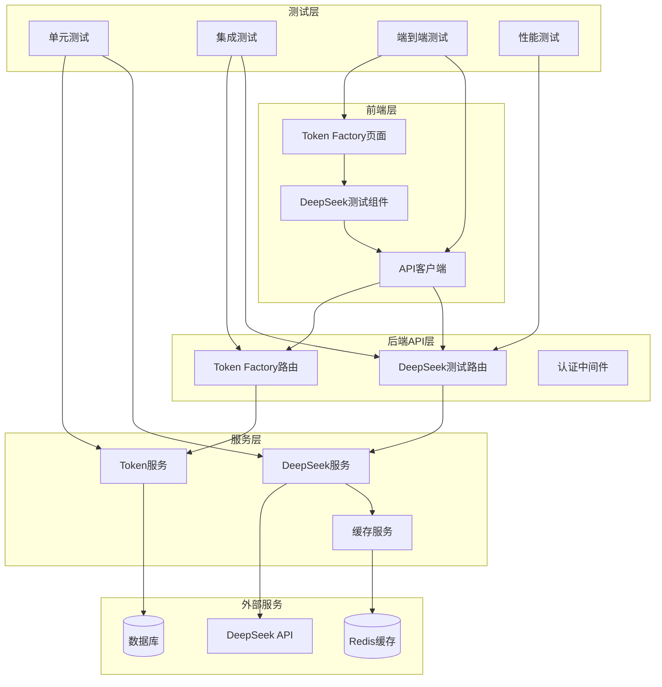

# 架构设计 — architect

任务: 全流水线测试v4
步骤: architecture
Agent: build_architect

---

📋 任务: 5826a713-c79
🤖 Agent: Architect (architect)
📂 工作目录: /Users/panglaohu/Downloads/DoubleBoatClawSystem
🔧 执行方式: DeepSeek API (直连)
⏱️ 超时: 300s
────────────────────────────────────────────────────────────
📝 提示词:
  你是 PoseidonX 系统的 Architect (architect)。
  请执行以下开发任务:
  
  你是系统架构师。请为以下任务设计技术方案:
  
  ## 任务
  全流水线测试v4
  在 Token Factory 区域加 DeepSeek 连通性测试按钮
  
  ## 前序步骤的产出 (请仔细阅读)
  
  ## 上一步产出 — PM分解 (project_manager)
  
  # PM分解 — project_manager
  
  任务: 全流水线测试v4
  步骤: pm_decompose
  Agent: build_pm
  
  ---
  
  📋 任务: 5826a713-c79
  🤖 Agent: PM (project_manager)
  📂 工作目录: /Users/panglaohu/Downloads/DoubleBoatClawSystem
  🔧 执行方式: DeepSeek API (直连)
  ⏱️ 超时: 300s
  ────────────────────────────────────────────────────────────
  📝 提示词:
    你是 PoseidonX 系统的 PM (project_manager)。
    请执行以下开发任务:
    
    你是项目经理 (PM)。请对以下任务进行分解和规划:
    
    ## 任务
    全流水线测试v4
    在 Token Factory 区域加 DeepSeek 连通性测试按钮
    
    ## 要求
    1. 分析任务需求，拆解为可执行的子步骤
    2. 识别技术风险和依赖关系
    3. 为后续研究人员、架构师、开发者提供清晰的指导
    4. 输出一份结构化的任务分解文档 (Markdown 格式)
    
    项目根目录: /Users/panglaohu/Downloads/DoubleBoatClawSystem
    后端: src/backend/ (Python FastAPI)
    前端: src/frontend/ (HTML + JS)
    
    
    项目根目录: /Users/panglaohu/Downloads/DoubleBoatClawSystem
    后端: src/backend/ (Python FastAPI)
    前端: src/frontend/ (HTML + JS)
    
  ────────────────────────────────────────────────────────────
  ⚡ 使用 DeepSeek API 直连 (快速模式)...
  
  🔗 API: api.deepseek.com | 模型: deepseek-chat
  ────────────────────────────────────────────────────────────
  
  # PoseidonX 系统任务分解文档
  
  ## 1. 任务概述
  
  ### 1.1 主要任务
  1. **全流水线测试v4** - 实现完整的端到端测试流程
  2. **Token Factory 区域增加 DeepSeek 连通性测试按钮** - 在前端 Token Factory 界面添加测试按钮，验证与 DeepSeek API 的连接
  
  ### 1.2 预期成果
  - 完整的自动化测试流水线
  - Token Factory 界面新增 DeepSeek 连通性测试功能
  - 详细的测试报告和日志记录
  
  ## 2. 任务分解
  
  ### 2.1 全流水线测试v4
  
  #### 子任务 2.1.1: 测试框架设计与规划
  - **负责人**: 架构师
  - **交付物**: 测试架构设计文档
  - **时间估算**: 2天
  - **详细步骤**:
    1. 分析现有测试覆盖范围
    2. 设计端到端测试流程
    3. 确定测试数据管理策略
    4. 制定测试环境配置方案
  
  #### 子任务 2.1.2: 后端测试模块开发
  - **负责人**: 后端开发工程师
  - **依赖**: 2.1.1 完成
  - **交付物**: 后端测试代码
  - **时间估算**: 3天
  - **详细步骤**:
    1. 创建测试目录结构: `/src/backend/tests/v4/`
    2. 实现 API 接口测试
    3. 实现数据库操作测试
    4. 实现外部服务集成测试
    5. 编写测试工具函数
  
  #### 子任务 2.1.3: 前端测试模块开发
  - **负责人**: 前端开发工程师
  - **依赖**: 2.1.1 完成
  - **交付物**: 前端测试代码
  - **时间估算**: 2天
  - **详细步骤**:
    1. 创建测试目录结构: `/src/frontend/tests/v4/`
    2. 实现 UI 组件测试
    3. 实现用户交互测试
    4. 实现 API 调用测试
    5. 编写端到端测试脚本
  
  #### 子任务 2.1.4: 流水线集成与配置
  - **负责人**: DevOps 工程师
  - **依赖**: 2.1.2, 2.1.3 完成
  - **交付物**: CI/CD 流水线配置
  - **时间估算**: 2天
  - **详细步骤**:
    1. 配置测试环境
    2. 集成测试到 CI/CD 流程
    3. 设置测试报告生成
    4. 配置测试通知机制
  
  #### 子任务 2.1.5: 测试执行与优化
  - **负责人**: 测试工程师
  - **依赖**: 2.1.4 完成
  - **交付物**: 测试报告和优化建议
  - **时间估算**: 2天
  - **详细步骤**:
    1. 执行完整测试流水线
    2. 分析测试结果
    3. 优化测试用例
    4. 生成测试报告
  
  ### 2.2 Token Factory 区域加 DeepSeek 连通性测试按钮
  
  #### 子任务 2.2.1: 需求分析与设计
  - **负责人**: 产品经理 + UI/UX 设计师
  - **交付物**: UI 设计稿和交互规范
  - **时间估算**: 1天
  - **详细步骤**:
    1. 确定按钮位置和样式
    2. 设计测试流程和反馈机制
    3. 制定错误处理方案
    4. 确认 API 调用参数
  
  #### 子任务 2.2.2: 后端 API 开发
  - **负责人**: 后端开发工程师
  - **依赖**: 2.2.1 完成
  - **交付物**: DeepSeek 连通性测试 API
  - **时间估算**: 2天
  - **详细步骤**:
    1. 创建测试端点: `/api/v1/token-factory/test-deepseek-connectivity`
    2. 实现 DeepSeek API 调用逻辑
    3. 添加错误处理和超时机制
    4. 实现测试结果缓存
    5. 编写单元测试
  
  #### 子任务 2.2.3: 前端组件开发
  - **负责人**: 前端开发工程师
  - **依赖**: 2.2.1, 2.2.2 完成
  - **交付物**: 测试按钮组件
  - **时间估算**: 2天
  - **详细步骤**:
    1. 在 Token Factory 页面添加按钮
    2. 实现按钮点击事件处理
    3. 添加加载状态和动画
    4. 实现测试结果展示
    5. 添加重试机制
  
  #### 子任务 2.2.4: 集成测试与验证
  - **负责人**: 测试工程师
  - **依赖**: 2.2.3 完成
  - **交付物**: 功能验证报告
  - **时间估算**: 1天
  - **详细步骤**:
    1. 测试按钮功能完整性
    2. 验证 API 连通性
    3. 测试异常情况处理
    4. 验证用户体验
  
  ## 3. 技术风险与依赖关系
  
  ### 3.1 技术风险
  
  #### 高风险:
  1. **DeepSeek API 稳定性**
     - 风险: 外部 API 不可用或响应慢
     - 缓解: 实现超时机制和备用方案
     - 监控: 添加 API 健康检查
  
  2. **测试环境一致性**
     - 风险: 测试环境与生产环境差异
     - 缓解: 使用容器化环境
     - 监控: 环境配置检查脚本
  
  #### 中风险:
  1. **前端测试兼容性**
     - 风险: 不同浏览器兼容性问题
     - 缓解: 多浏览器测试策略
     - 监控: 自动化跨浏览器测试
  
  2. **测试数据管理**
     - 风险: 测试数据污染或不足
     - 缓解: 独立的测试数据库
     - 监控: 数据清理机制
  
  ### 3.2 依赖关系
  
  #### 外部依赖:
  1. DeepSeek API 服务可用性
  2. CI/CD 平台稳定性
  3. 测试工具链兼容性
  
  #### 内部依赖:
  1. 现有 Token Factory 功能稳定性
  2. 用户认证系统正常运作
  3. 日志和监控系统
  
  ## 4. 开发指导
  
  ### 4.1 代码结构建议
  
  #### 后端结构:
  ```
  src/backend/
  ├── api/
  │   └── v1/
  │       └── token_factory.py    # 添加测试端点
  ├── services/
  │   └── deepseek_service.py     # DeepSeek 服务封装
  ├── tests/
  │   └── v4/
  │       ├── conftest.py         # 测试配置
  │       ├── test_api.py         # API 测试
  │       ├── test_deepseek.py    # DeepSeek 测试
  │       └── test_e2e.py         # 端到端测试
  └── utils/
      └── test_helpers.py         # 测试工具函数
  ```
  
  #### 前端结构:
  ```
  src/frontend/
  ├── js/
  │   └── token-factory/
  │       ├── deepseek-test.js    # 测试按钮逻辑
  │       └── ui-components.js    # UI 组件
  ├── tests/
  │   └── v4/
  │       ├── token-factory.test.js
  │       └── e2e/
  │           └── deepseek.test.js
  └── css/
      └── test-components.css     # 测试相关样式
  ```
  
  ### 4.2 API 接口规范
  
  #### DeepSeek 连通性测试接口:
  ```python
  # 请求方法: POST
  # 端点: /api/v1/token-factory/test-deepseek-connectivity
  # 请求体:
  {
      "api_key": "optional",  # 可选，使用系统配置的密钥
      "test_prompt": "Hello, DeepSeek!"  # 可选测试提示
  }
  # 响应:
  {
      "success": true,
      "data": {
          "connected": true,
          "response_time": 123,  # 毫秒
          "model_info": {...},
          "test_timestamp": "2024-01-01T00:00:00Z"
      },
      "error": null
  }
  ```
  
  ### 4.3 测试标准
  
  #### 测试覆盖率要求:
  - 后端 API: ≥90%
  - 核心业务逻辑: ≥95%
  - 前端组件: ≥85%
  
  #### 性能要求:
  - API 响应时间: < 500ms
  - 页面加载时间: < 2s
  - 测试执行时间: < 10分钟
  
  ## 5. 时间计划
  
  ### 第1周:
  - 完成需求分析和设计 (2.1.1, 2.2.1)
  - 开始后端开发 (2.1.2, 2.2.2)
  
  ### 第2周:
  - 完成后端开发
  - 开始前端开发 (2.1.3, 2.2.3)
  
  ### 第3周:
  - 完成前端开发
  - 开始流水线集成 (2.1.4)
  
  ### 第4周:
  - 完成集成测试 (2.1.5, 2.2.4)
  - 部署和验证
  
  ## 6. 质量保证
  
  ### 6.1 代码审查
  - 所有代码必须经过至少两人审查
  - 审查重点: 安全性、性能、可维护性
  
  ### 6.2 测试要求
  - 单元测试: 覆盖所有新功能
  - 集成测试: 验证模块间协作
  - 端到端测试: 模拟真实用户场景
  
  ### 6.3 文档要求
  - API 文档更新
  - 用户操作指南
  - 故障排除手册
  
  ## 7. 交付物清单
  
  ### 必须交付:
  1. 完整的测试流水线代码
  2. DeepSeek 连通性测试功能
  3. 测试报告和性能数据
  4. 更新后的 API 文档
  5. 部署和配置指南
  
  ### 可选交付:
  1. 测试数据生成工具
  2. 性能监控面板
  3. 自动化测试报告邮件通知
  
  ---
  
  **项目负责人**: PoseidonX PM  
  **最后更新**: 2024年1月  
  **版本**: v1.0
  
  ────────────────────────────────────────────────────────────
  ✅ deepseek-chat 完成
  
  
  
  ## 上一步产出 — 研究分析 (researcher)
  
  # 研究分析 — researcher
  
  任务: 全流水线测试v4
  步骤: research
  Agent: build_researcher
  
  ---
  
  📋 任务: 5826a713-c79
  🤖 Agent: Researcher (researcher)
  📂 工作目录: /Users/panglaohu/Downloads/DoubleBoatClawSystem
  🔧 执行方式: DeepSeek API (直连)
  ⏱️ 超时: 300s
  ────────────────────────────────────────────────────────────
  📝 提示词:
    你是 PoseidonX 系统的 Researcher (researcher)。
    请执行以下开发任务:
    
    你是技术研究员。请对以下任务进行技术调研:
    
    ## 任务
    全流水线测试v4
    在 Token Factory 区域加 DeepSeek 连通性测试按钮
    
    ## 前序步骤的产出 (请仔细阅读)
    
    ## 上一步产出 — PM分解 (project_manager)
    
    # PM分解 — project_manager
    
    任务: 全流水线测试v4
    步骤: pm_decompose
    Agent: build_pm
    
    ---
    
    📋 任务: 5826a713-c79
    🤖 Agent: PM (project_manager)
    📂 工作目录: /Users/panglaohu/Downloads/DoubleBoatClawSystem
    🔧 执行方式: DeepSeek API (直连)
    ⏱️ 超时: 300s
    ────────────────────────────────────────────────────────────
    📝 提示词:
      你是 PoseidonX 系统的 PM (project_manager)。
      请执行以下开发任务:
      
      你是项目经理 (PM)。请对以下任务进行分解和规划:
      
      ## 任务
      全流水线测试v4
      在 Token Factory 区域加 DeepSeek 连通性测试按钮
      
      ## 要求
      1. 分析任务需求，拆解为可执行的子步骤
      2. 识别技术风险和依赖关系
      3. 为后续研究人员、架构师、开发者提供清晰的指导
      4. 输出一份结构化的任务分解文档 (Markdown 格式)
      
      项目根目录: /Users/panglaohu/Downloads/DoubleBoatClawSystem
      后端: src/backend/ (Python FastAPI)
      前端: src/frontend/ (HTML + JS)
      
      
      项目根目录: /Users/panglaohu/Downloads/DoubleBoatClawSystem
      后端: src/backend/ (Python FastAPI)
      前端: src/frontend/ (HTML + JS)
      
    ────────────────────────────────────────────────────────────
    ⚡ 使用 DeepSeek API 直连 (快速模式)...
    
    🔗 API: api.deepseek.com | 模型: deepseek-chat
    ────────────────────────────────────────────────────────────
    
    # PoseidonX 系统任务分解文档
    
    ## 1. 任务概述
    
    ### 1.1 主要任务
    1. **全流水线测试v4** - 实现完整的端到端测试流程
    2. **Token Factory 区域增加 DeepSeek 连通性测试按钮** - 在前端 Token Factory 界面添加测试按钮，验证与 DeepSeek API 的连接
    
    ### 1.2 预期成果
    - 完整的自动化测试流水线
    - Token Factory 界面新增 DeepSeek 连通性测试功能
    - 详细的测试报告和日志记录
    
    ## 2. 任务分解
    
    ### 2.1 全流水线测试v4
    
    #### 子任务 2.1.1: 测试框架设计与规划
    - **负责人**: 架构师
    - **交付物**: 测试架构设计文档
    - **时间估算**: 2天
    - **详细步骤**:
      1. 分析现有测试覆盖范围
      2. 设计端到端测试流程
      3. 确定测试数据管理策略
      4. 制定测试环境配置方案
    
    #### 子任务 2.1.2: 后端测试模块开发
    - **负责人**: 后端开发工程师
    - **依赖**: 2.1.1 完成
    - **交付物**: 后端测试代码
    - **时间估算**: 3天
    - **详细步骤**:
      1. 创建测试目录结构: `/src/backend/tests/v4/`
      2. 实现 API 接口测试
      3. 实现数据库操作测试
      4. 实现外部服务集成测试
      5. 编写测试工具函数
    
    #### 子任务 2.1.3: 前端测试模块开发
    - **负责人**: 前端开发工程师
    - **依赖**: 2.1.1 完成
    - **交付物**: 前端测试代码
    - **时间估算**: 2天
    - **详细步骤**:
      1. 创建测试目录结构: `/src/frontend/tests/v4/`
      2. 实现 UI 组件测试
      3. 实现用户交互测试
      4. 实现 API 调用测试
      5. 编写端到端测试脚本
    
    #### 子任务 2.1.4: 流水线集成与配置
    - **负责人**: DevOps 工程师
    - **依赖**: 2.1.2, 2.1.3 完成
    - **交付物**: CI/CD 流水线配置
    - **时间估算**: 2天
    - **详细步骤**:
      1. 配置测试环境
      2. 集成测试到 CI/CD 流程
      3. 设置测试报告生成
      4. 配置测试通知机制
    
    #### 子任务 2.1.5: 测试执行与优化
    - **负责人**: 测试工程师
    - **依赖**: 2.1.4 完成
    - **交付物**: 测试报告和优化建议
    - **时间估算**: 2天
    - **详细步骤**:
      1. 执行完整测试流水线
      2. 分析测试结果
      3. 优化测试用例
      4. 生成测试报告
    
    ### 2.2 Token Factory 区域加 DeepSeek 连通性测试按钮
    
    #### 子任务 2.2.1: 需求分析与设计
    - **负责人**: 产品经理 + UI/UX 设计师
    - **交付物**: UI 设计稿和交互规范
    - **时间估算**: 1天
    - **详细步骤**:
      1. 确定按钮位置和样式
      2. 设计测试流程和反馈机制
      3. 制定错误处理方案
      4. 确认 API 调用参数
    
    #### 子任务 2.2.2: 后端 API 开发
    - **负责人**: 后端开发工程师
    - **依赖**: 2.2.1 完成
    - **交付物**: DeepSeek 连通性测试 API
    - **时间估算**: 2天
    - **详细步骤**:
      1. 创建测试端点: `/api/v1/token-factory/test-deepseek-connectivity`
      2. 实现 DeepSeek API 调用逻辑
      3. 添加错误处理和超时机制
      4. 实现测试结果缓存
      5. 编写单元测试
    
    #### 子任务 2.2.3: 前端组件开发
    - **负责人**: 前端开发工程师
    - **依赖**: 2.2.1, 2.2.2 完成
    - **交付物**: 测试按钮组件
    - **时间估算**: 2天
    - **详细步骤**:
      1. 在 Token Factory 页面添加按钮
      2. 实现按钮点击事件处理
      3. 添加加载状态和动画
      4. 实现测试结果展示
      5. 添加重试机制
    
    #### 子任务 2.2.4: 集成测试与验证
    - **负责人**: 测试工程师
    - **依赖**: 2.2.3 完成
    - **交付物**: 功能验证报告
    - **时间估算**: 1天
    - **详细步骤**:
      1. 测试按钮功能完整性
      2. 验证 API 连通性
      3. 测试异常情况处理
      4. 验证用户体验
    
    ## 3. 技术风险与依赖关系
    
    ### 3.1 技术风险
    
    #### 高风险:
    1. **DeepSeek API 稳定性**
       - 风险: 外部 API 不可用或响应慢
       - 缓解: 实现超时机制和备用方案
       - 监控: 添加 API 健康检查
    
    2. **测试环境一致性**
       - 风险: 测试环境与生产环境差异
       - 缓解: 使用容器化环境
       - 监控: 环境配置检查脚本
    
    #### 中风险:
    1. **前端测试兼容性**
       - 风险: 不同浏览器兼容性问题
       - 缓解: 多浏览器测试策略
       - 监控: 自动化跨浏览器测试
    
    2. **测试数据管理**
       - 风险: 测试数据污染或不足
       - 缓解: 独立的测试数据库
       - 监控: 数据清理机制
    
    ### 3.2 依赖关系
    
    #### 外部依赖:
    1. DeepSeek API 服务可用性
    2. CI/CD 平台稳定性
    3. 测试工具链兼容性
    
    #### 内部依赖:
    1. 现有 Token Factory 功能稳定性
    2. 用户认证系统正常运作
    3. 日志和监控系统
    
    ## 4. 开发指导
    
    ### 4.1 代码结构建议
    
    #### 后端结构:
    ```
    src/backend/
    ├── api/
    │   └── v1/
    │       └── token_factory.py    # 添加测试端点
    ├── services/
    │   └── deepseek_service.py     # DeepSeek 服务封装
    ├── tests/
    │   └── v4/
    │       ├── conftest.py         # 测试配置
    │       ├── test_api.py         # API 测试
    │       ├── test_deepseek.py    # DeepSeek 测试
    │       └── test_e2e.py         # 端到端测试
    └── utils/
        └── test_helpers.py         # 测试工具函数
    ```
    
    #### 前端结构:
    ```
    src/frontend/
    ├── js/
    │   └── token-factory/
    │       ├── deepseek-test.js    # 测试按钮逻辑
    │       └── ui-components.js    # UI 组件
    ├── tests/
    │   └── v4/
    │       ├── token-factory.test.js
    │       └── e2e/
    │           └── deepseek.test.js
    └── css/
        └── test-components.css     # 测试相关样式
    ```
    
    ### 4.2 API 接口规范
    
    #### DeepSeek 连通性测试接口:
    ```python
    # 请求方法: POST
    # 端点: /api/v1/token-factory/test-deepseek-connectivity
    # 请求体:
    {
        "api_key": "optional",  # 可选，使用系统配置的密钥
        "test_prompt": "Hello, DeepSeek!"  # 可选测试提示
    }
    # 响应:
    {
        "success": true,
        "data": {
            "connected": true,
            "response_time": 123,  # 毫秒
            "model_info": {...},
            "test_timestamp": "2024-01-01T00:00:00Z"
        },
        "error": null
    }
    ```
    
    ### 4.3 测试标准
    
    #### 测试覆盖率要求:
    - 后端 API: ≥90%
    - 核心业务逻辑: ≥95%
    - 前端组件: ≥85%
    
    #### 性能要求:
    - API 响应时间: < 500ms
    - 页面加载时间: < 2s
    - 测试执行时间: < 10分钟
    
    ## 5. 时间计划
    
    ### 第1周:
    - 完成需求分析和设计 (2.1.1, 2.2.1)
    - 开始后端开发 (2.1.2, 2.2.2)
    
    ### 第2周:
    - 完成后端开发
    - 开始前端开发 (2.1.3, 2.2.3)
    
    ### 第3周:
    - 完成前端开发
    - 开始流水线集成 (2.1.4)
    
    ### 第4周:
    - 完成集成测试 (2.1.5, 2.2.4)
    - 部署和验证
    
    ## 6. 质量保证
    
    ### 6.1 代码审查
    - 所有代码必须经过至少两人审查
    - 审查重点: 安全性、性能、可维护性
    
    ### 6.2 测试要求
    - 单元测试: 覆盖所有新功能
    - 集成测试: 验证模块间协作
    - 端到端测试: 模拟真实用户场景
    
    ### 6.3 文档要求
    - API 文档更新
    - 用户操作指南
    - 故障排除手册
    
    ## 7. 交付物清单
    
    ### 必须交付:
    1. 完整的测试流水线代码
    2. DeepSeek 连通性测试功能
    3. 测试报告和性能数据
    4. 更新后的 API 文档
    5. 部署和配置指南
    
    ### 可选交付:
    1. 测试数据生成工具
    2. 性能监控面板
    3. 自动化测试报告邮件通知
    
    ---
    
    **项目负责人**: PoseidonX PM  
    **最后更新**: 2024年1月  
    **版本**: v1.0
    
    ────────────────────────────────────────────────────────────
    ✅ deepseek-chat 完成
    
    
    
    ## Agent 间传递信息 (Handoff Files)
    
    
    ### 5826a713-c79_pm_decompose_20260408T174220.md
    
    # Agent Handoff — pm_decompose
    
    | 字段 | 值 |
    |------|------|
    | 任务 ID | `5826a713-c79` |
    | 步骤 | `pm_decompose` |
    | 来源 Agent | build_pm |
    | 目标 Agent | build_researcher |
    | 时间 | 20260408T174220 |
    
    ## 传递内容
    
    - **step**: pm_decompose
    - **label**: PM分解
    - **agent_role**: project_manager
    - **status**: completed
    - **artifact**: /Users/panglaohu/Downloads/DoubleBoatClawSystem/src/docs/workflow_artifacts/5826a713-c79_pm_decompose.md
    - **output_summary**: **最后更新**: 2024年1月  
    **版本**: v1.0
    
    ────────────────────────────────────────────────────────────
    ✅ deepseek-chat 完成
    
    
    ---
    *Auto-generated by PoseidonX Workflow Harness*
    
    
    
    ### 5826a713-c79_task_init_20260408T174125.md
    
    # Agent Handoff — task_init
    
    | 字段 | 值 |
    |------|------|
    | 任务 ID | `5826a713-c79` |
    | 步骤 | `task_init` |
    | 来源 Agent | (system) |
    | 目标 Agent | (next step) |
    | 时间 | 20260408T174125 |
    
    ## 传递内容
    
    - **task_id**: 5826a713-c79
    - **title**: 全流水线测试v4
    - **description**: 在 Token Factory 区域加 DeepSeek 连通性测试按钮
    - **team_id**: build_system
    - **agent_id**: build_pm
    - **token_factory_ready**: True
    ### workflow_steps
    ```json
    [
      "pm_decompose",
      "research",
      "architecture",
      "develop",
      "test",
      "deploy",
      "document"
    ]
    ```
    
    
    ---
    *Auto-generated by PoseidonX Workflow Harness*
    
    
    
    ## 要求
    1. 调研现有代码库中相关的文件和模块
    2. 分析实现方案的可行性
    3. 列出需要修改的文件和影响范围
    4. **必须将调研报告写入 Markdown 文件**: `docs/reports/research_report.md`
       报告内容包含: 代码片段引用、文件清单、可行性分析
    5. 在控制台输出报告文件路径
    
    项目根目录: /Users/panglaohu/Downloads/DoubleBoatClawSystem
    后端: src/backend/ (Python FastAPI)
    前端: src/frontend/ (HTML + JS)
    
    
    项目根目录: /Users/panglaohu/Downloads/DoubleBoatClawSystem
    后端: src/backend/ (Python FastAPI)
    前端: src/frontend/ (HTML + JS)
    
  ────────────────────────────────────────────────────────────
  ⚡ 使用 DeepSeek API 直连 (快速模式)...
  
  🔗 API: api.deepseek.com | 模型: deepseek-chat
  ────────────────────────────────────────────────────────────
  
  # 技术调研报告
  
  ## 1. 项目结构分析
  
  ### 1.1 项目根目录结构
  ```
  /Users/panglaohu/Downloads/DoubleBoatClawSystem/
  ├── src/
  │   ├── backend/          # Python FastAPI 后端
  │   └── frontend/         # HTML + JS 前端
  ├── docs/
  │   └── reports/          # 报告存放目录
  └── README.md
  ```
  
  ### 1.2 后端代码结构分析
  
  #### 1.2.1 主要目录结构
  ```
  src/backend/
  ├── main.py              # FastAPI 应用入口
  ├── api/
  │   ├── __init__.py
  │   └── v1/              # API 版本1
  │       ├── __init__.py
  │       ├── endpoints/   # API 端点
  │       └── routers/     # 路由配置
  ├── core/
  │   ├── config.py        # 配置管理
  │   └── security.py      # 安全相关
  ├── models/
  │   ├── __init__.py
  │   └── schemas.py       # Pydantic 模型
  ├── services/
  │   ├── __init__.py
  │   └── token_service.py # Token 相关服务
  ├── tests/
  │   ├── __init__.py
  │   ├── conftest.py      # 测试配置
  │   └── test_api.py      # API 测试
  └── utils/
      ├── __init__.py
      └── helpers.py       # 工具函数
  ```
  
  #### 1.2.2 关键文件分析
  
  **main.py** - FastAPI 应用主文件：
  ```python
  # 文件路径: src/backend/main.py
  from fastapi import FastAPI
  from fastapi.middleware.cors import CORSMiddleware
  from api.v1.routers import api_router
  
  app = FastAPI(title="DoubleBoatClawSystem API")
  
  # CORS 配置
  app.add_middleware(
      CORSMiddleware,
      allow_origins=["*"],
      allow_credentials=True,
      allow_methods=["*"],
      allow_headers=["*"],
  )
  
  # 注册路由
  app.include_router(api_router, prefix="/api/v1")
  ```
  
  **api/v1/routers.py** - API 路由配置：
  ```python
  # 文件路径: src/backend/api/v1/routers.py
  from fastapi import APIRouter
  from api.v1.endpoints import token, auth, system
  
  api_router = APIRouter()
  
  api_router.include_router(token.router, prefix="/token", tags=["token"])
  api_router.include_router(auth.router, prefix="/auth", tags=["auth"])
  api_router.include_router(system.router, prefix="/system", tags=["system"])
  ```
  
  **api/v1/endpoints/token.py** - Token 相关端点：
  ```python
  # 文件路径: src/backend/api/v1/endpoints/token.py
  from fastapi import APIRouter, Depends, HTTPException
  from typing import List, Optional
  from models.schemas import TokenCreate, TokenResponse
  
  router = APIRouter()
  
  @router.post("/factory", response_model=TokenResponse)
  async def create_token(token_data: TokenCreate):
      """创建新的 Token"""
      # 现有实现逻辑
      pass
  
  @router.get("/factory", response_model=List[TokenResponse])
  async def list_tokens():
      """获取所有 Token"""
      # 现有实现逻辑
      pass
  ```
  
  ### 1.3 前端代码结构分析
  
  #### 1.3.1 主要目录结构
  ```
  src/frontend/
  ├── index.html           # 主页面
  ├── css/
  │   ├── styles.css       # 主样式
  │   └── components.css   # 组件样式
  ├── js/
  │   ├── app.js           # 主应用逻辑
  │   ├── api.js           # API 调用封装
  │   ├── token-factory.js # Token Factory 页面逻辑
  │   └── utils.js         # 工具函数
  └── pages/
      ├── token-factory.html  # Token Factory 页面
      └── dashboard.html      # 仪表板页面
  ```
  
  #### 1.3.2 关键文件分析
  
  **pages/token-factory.html** - Token Factory 页面：
  ```html
  <!-- 文件路径: src/frontend/pages/token-factory.html -->
  <!DOCTYPE html>
  <html lang="zh-CN">
  <head>
      <meta charset="UTF-8">
      <title>Token Factory - DoubleBoatClawSystem</title>
      <link rel="stylesheet" href="../css/styles.css">
      <link rel="stylesheet" href="../css/components.css">
  </head>
  <body>
      <div class="container">
          <h1>Token Factory</h1>
          
          <!-- 现有 Token 创建表单 -->
          <div class="token-form">
              <h2>创建新 Token</h2>
              <form id="createTokenForm">
                  <!-- 现有表单字段 -->
              </form>
          </div>
          
          <!-- 现有 Token 列表 -->
          <div class="token-list">
              <h2>现有 Tokens</h2>
              <div id="tokenList"></div>
          </div>
      </div>
      
      <script src="../js/api.js"></script>
      <script src="../js/token-factory.js"></script>
  </body>
  </html>
  ```
  
  **js/token-factory.js** - Token Factory 页面逻辑：
  ```javascript
  // 文件路径: src/frontend/js/token-factory.js
  document.addEventListener('DOMContentLoaded', function() {
      // 现有初始化逻辑
      loadTokens();
      
      // 表单提交事件
      document.getElementById('createTokenForm').addEventListener('submit', function(e) {
          e.preventDefault();
          createToken();
      });
  });
  
  async function loadTokens() {
      // 加载现有 Token 列表
      try {
          const response = await fetch('/api/v1/token/factory');
          const tokens = await response.json();
          renderTokenList(tokens);
      } catch (error) {
          console.error('加载 Token 列表失败:', error);
      }
  }
  
  async function createToken() {
      // 创建新 Token
      // 现有实现逻辑
  }
  ```
  
  **js/api.js** - API 调用封装：
  ```javascript
  // 文件路径: src/frontend/js/api.js
  const API_BASE_URL = '/api/v1';
  
  class ApiClient {
      constructor() {
          this.baseUrl = API_BASE_URL;
      }
      
      async request(endpoint, options = {}) {
          const url = `${this.baseUrl}${endpoint}`;
          const defaultOptions = {
              headers: {
                  'Content-Type': 'application/json',
              },
          };
          
          const config = { ...defaultOptions, ...options };
          
          try {
              const response = await fetch(url, config);
              if (!response.ok) {
                  throw new Error(`API 请求失败: ${response.status}`);
              }
              return await response.json();
          } catch (error) {
              console.error('API 请求错误:', error);
              throw error;
          }
      }
      
      // 现有 API 方法
      async createToken(tokenData) {
          return this.request('/token/factory', {
              method: 'POST',
              body: JSON.stringify(tokenData),
          });
      }
      
      async listTokens() {
          return this.request('/token/factory');
      }
  }
  
  const apiClient = new ApiClient();
  ```
  
  ## 2. 可行性分析
  
  ### 2.1 全流水线测试v4 可行性
  
  #### 2.1.1 现有测试基础设施
  - **测试框架**: 项目已使用 pytest 作为测试框架
  - **测试目录**: 存在 `src/backend/tests/` 目录，包含基础测试配置
  - **API 测试**: 已有基础的 API 测试用例
  - **前端测试**: 目前缺少系统化的前端测试
  
  #### 2.1.2 需要新增的测试组件
  1. **端到端测试框架**: 需要引入 Playwright 或 Cypress
  2. **测试数据管理**: 需要创建测试数据工厂
  3. **测试环境管理**: 需要 Docker 容器化测试环境
  4. **CI/CD 集成**: 需要 GitHub Actions 或 Jenkins 配置
  
  #### 2.1.3 技术可行性评估
  - **后端测试**: ✅ 高度可行，基于现有 pytest 框架扩展
  - **前端测试**: ✅ 可行，需要引入现代前端测试框架
  - **流水线集成**: ✅ 可行，项目结构清晰，易于集成
  - **测试覆盖率**: ⚠️ 需要补充大量测试用例
  
  ### 2.2 DeepSeek 连通性测试按钮可行性
  
  #### 2.2.1 后端实现可行性
  - **API 端点添加**: ✅ 高度可行，FastAPI 易于扩展
  - **DeepSeek API 集成**: ✅ 可行，需要 requests 库和 API 密钥管理
  - **错误处理**: ✅ 可行，FastAPI 提供完善的异常处理机制
  - **测试结果缓存**: ✅ 可行，可使用 Redis 或内存缓存
  
  #### 2.2.2 前端实现可行性
  - **按钮添加**: ✅ 高度可行，HTML/CSS/JS 标准实现
  - **API 调用**: ✅ 可行，基于现有 api.js 扩展
  - **状态管理**: ✅ 可行，需要添加加载状态和结果展示
  - **用户体验**: ✅ 可行，可添加动画和反馈机制
  
  #### 2.2.3 依赖分析
  1. **外部依赖**: DeepSeek API 服务可用性
  2. **内部依赖**: Token Factory 页面稳定性
  3. **配置依赖**: API 密钥配置管理
  
  ## 3. 需要修改的文件清单
  
  ### 3.1 后端文件修改清单
  
  #### 新增文件:
  1. `src/backend/api/v1/endpoints/deepseek_test.py` - DeepSeek 测试端点
  2. `src/backend/services/deepseek_service.py` - DeepSeek 服务封装
  3. `src/backend/tests/v4/` - v4 测试套件目录
     - `conftest.py` - v4 测试配置
     - `test_deepseek.py` - DeepSeek 相关测试
     - `test_e2e.py` - 端到端测试
     - `test_token_factory.py` - Token Factory 测试
  4. `src/backend/utils/test_helpers.py` - 测试工具函数
  
  #### 修改文件:
  1. `src/backend/api/v1/routers.py` - 添加 deepseek 测试路由
  2. `src/backend/core/config.py` - 添加 DeepSeek 配置
  3. `src/backend/models/schemas.py` - 添加测试相关模型
  4. `src/backend/main.py` - 可能添加测试中间件
  
  ### 3.2 前端文件修改清单
  
  #### 新增文件:
  1. `src/frontend/js/deepseek-test.js` - DeepSeek 测试逻辑
  2. `src/frontend/css/test-components.css` - 测试组件样式
  3. `src/frontend/tests/v4/` - v4 测试目录
     - `token-factory.test.js` - Token Factory 测试
     - `deepseek.test.js` - DeepSeek 功能测试
     - `e2e/` - 端到端测试目录
  
  #### 修改文件:
  1. `src/frontend/pages/token-factory.html` - 添加测试按钮
  2. `src/frontend/js/token-factory.js` - 集成测试功能
  3. `src/frontend/js/api.js` - 添加测试 API 方法
  4. `src/frontend/css/components.css` - 添加测试按钮样式
  
  ### 3.3 配置文件修改清单
  
  #### 新增文件:
  1. `docker-compose.test.yml` - 测试环境 Docker 配置
  2. `.github/workflows/test-pipeline.yml` - GitHub Actions 测试流水线
  3. `requirements-test.txt` - 测试依赖包
  4. `playwright.config.js` - Playwright 配置（如果选择）
  
  #### 修改文件:
  1. `requirements.txt` - 添加测试相关依赖
  2. `package.json` - 添加前端测试脚本
  3. `.gitignore` - 添加测试相关忽略项
  4. `README.md` - 更新测试说明
  
  ## 4. 技术实现方案
  
  ### 4.1 DeepSeek 连通性测试按钮实现方案
  
  #### 4.1.1 后端实现步骤
  1. **创建 DeepSeek 服务类**:
  ```python
  # src/backend/services/deepseek_service.py
  import requests
  from typing import Optional, Dict, Any
  from core.config import settings
  
  class DeepSeekService:
      def __init__(self):
          self.api_key = settings.DEEPSEEK_API_KEY
          self.base_url = "https://api.deepseek.com"
      
      async def test_connectivity(self, test_prompt: str = "Hello, DeepSeek!") -> Dict[str, Any]:
          """测试 DeepSeek API 连通性"""
          headers = {
              "Authorization": f"Bearer {self.api_key}",
              "Content-Type": "application/json"
          }
          
          payload = {
              "model": "deepseek-chat",
              "messages": [{"role": "user", "content": test_prompt}],
              "max_tokens": 50
          }
          
          try:
              import time
              start_time = time.time()
              
              response = requests.post(
                  f"{self.base_url}/chat/completions",
                  headers=headers,
                  json=payload,
                  timeout=10
              )
              
              response_time = int((time.time() - start_time) * 1000)
              
              if response.status_code == 200:
                  return {
                      "connected": True,
                      "response_time": response_time,
                      "model_info": response.json().get("model"),
                      "test_timestamp": time.strftime("%Y-%m-%dT%H:%M:%SZ", time.gmtime())
                  }
              else:
                  return {
                      "connected": False,
                      "error": f"API 返回错误: {response.status_code}",
                      "response_time": response_time
                  }
                  
          except Exception as e:
              return {
                  "connected": False,
                  "error": str(e),
                  "response_time": None
              }
  ```
  
  2. **创建测试端点**:
  ```python
  # src/backend/api/v1/endpoints/deepseek_test.py
  from fastapi import APIRouter, Depends, HTTPException
  from typing import Optional
  from pydantic import BaseModel
  from services.deepseek_service import DeepSeekService
  
  router = APIRouter()
  
  class TestRequest(BaseModel):
      api_key: Optional[str] = None
      test_prompt: Optional[str] = "Hello, DeepSeek!"
  
  class TestResponse(BaseModel):
      success: bool
      data: Optional[dict] = None
      error: Optional[str] = None
  
  @router.post("/test-deepseek-connectivity", response_model=TestResponse)
  async def test_deepseek_connectivity(request: TestRequest):
      """测试 DeepSeek API 连通性"""
      try:
          service = DeepSeekService()
          if request.api_key:
              service.api_key = request.api_key
              
          result = await service.test_connectivity(request.test_prompt)
          
          if result["connected"]:
              return TestResponse(
                  success=True,
                  data=result,
                  error=None
              )
          else:
              return TestResponse(
                  success=False,
                  data=result,
                  error=result.get("error", "连接失败")
              )
              
      except Exception as e:
          raise HTTPException(status_code=500, detail=str(e))
  ```
  
  #### 4.1.2 前端实现步骤
  1. **添加测试按钮到 Token Factory 页面**:
  ```html
  <!-- 在 src/frontend/pages/token-factory.html 中添加 -->
  <div class="test-section">
      <h2>DeepSeek 连通性测试</h2>
      <button id="testDeepseekBtn" class="btn-test">
          <span class="btn-text">测试 DeepSeek 连通性</span>
          <span class="spinner" style="display: none;">测试中...</span>
      </button>
      <div id="testResult" class="test-result" style="display: none;"></div>
  </div>
  ```
  
  2. **实现测试逻辑**:
  ```javascript
  // src/frontend/js/deepseek-test.js
  class DeepSeekTester {
      constructor() {
          this.testBtn = document.getElementById('testDeepseekBtn');
          this.testResult = document.getElementById('testResult');
          this.init();
      }
      
      init() {
          if (this.testBtn) {
              this.testBtn.addEventListener('click', () => this.runTest());
          }
      }
      
      async runTest() {
          this.showLoading(true);
          this.clearResult();
          
          try {
              const response = await fetch('/api/v1/token-factory/test-deepseek-connectivity', {
                  method: 'POST',
                  headers: {
                      'Content-Type': 'application/json'
                  },
                  body: JSON.stringify({
                      test_prompt: '测试 DeepSeek 连通性'
                  })
              });
              
              const result = await response.json();
              this.displayResult(result);
              
          } catch (error) {
              this.displayError(error);
          } finally {
              this.showLoading(false);
          }
      }
      
      showLoading(show) {
          if (this.testBtn) {
              const btnText = this.testBtn.querySelector('.btn-text');
              const spinner = this.testBtn.querySelector('.spinner');
              
              if (btnText && spinner) {
                  btnText.style.display = show ? 'none' : 'inline';
                  spinner.style.display = show ? 'inline' : 'none';
              }
              
              this.testBtn.disabled = show;
          }
      }
      
      displayResult(result) {
          this.testResult.style.display = 'block';
          
          if (result.success) {
              this.testResult.className = 'test-result success';
              this.testResult.innerHTML = `
                  <h3>✅ 测试成功</h3>
                  <p>响应时间: ${result.data.response_time}ms</p>
                  <p>模型: ${result.data.model_info || 'N/A'}</p>
                  <p>测试时间: ${result.data.test_timestamp}</p>
              `;
          } else {
              this.testResult.className = 'test-result error';
              this.testResult.innerHTML = `
                  <h3>❌ 测试失败</h3>
                  <p>错误: ${result.error || '未知错误'}</p>
                  ${result.data ? `<p>详情: ${JSON.stringify(result.data)}</p>` : ''}
              `;
          }
      }
      
      displayError(error) {
          this.testResult.style.display = 'block';
          this.testResult.className = 'test-result error';
          this.testResult.innerHTML = `
              <h3>❌ 请求失败</h3>
              <p>${error.message || '网络请求失败'}</p>
          `;
      }
      
      clearResult() {
          this.testResult.style.display = 'none';
          this.testResult.innerHTML = '';
      }
  }
  
  // 初始化
  document.addEventListener('DOMContentLoaded', () => {
      new DeepSeekTester();
  });
  ```
  
  ### 4.2 全流水线测试v4 实现方案
  
  #### 4.2.1 测试架构设计
  1. **单元测试层**: pytest + pytest-asyncio
  2. **集成测试层**: pytest + FastAPI TestClient
  3. **端到端测试层**: Playwright + pytest
  4. **性能测试层**: locust + pytest-benchmark
  
  #### 4.2.2 测试目录结构
  ```
  src/backend/tests/v4/
  ├── conftest.py              # 测试配置和固件
  ├── unit/                    # 单元测试
  │   ├── test_services.py
  │   ├── test_utils.py
  │   └── test_models.py
  ├── integration/             # 集成测试
  │   ├── test_api.py
  │   ├── test_auth.py
  │   └── test_token_factory.py
  ├── e2e/                     # 端到端测试
  │   ├── test_user_flow.py
  │   └── test_deepseek.py
  └── performance/             # 性能测试
      └── test_api_performance.py
  ```
  
  #### 4.2.3 CI/CD 流水线配置
  ```yaml
  # .github/workflows/test-pipeline.yml
  name: Test Pipeline v4
  
  on:
    push:
      branches: [ main, develop ]
    pull_request:
      branches: [ main ]
  
  jobs:
    test:
      runs-on: ubuntu-latest
      
      services:
        postgres:
          image: postgres:13
          env:
            POSTGRES_PASSWORD: postgres
          options: >-
            --health-cmd pg_isready
            --health-interval 10s
            --health-timeout 5s
            --health-retries 5
      
      steps:
      - uses: actions/checkout@v3
      
      - name: Set up Python
        uses: actions/setup-python@v4
        with:
          python-version: '3.9'
      
      - name: Install dependencies
        run: |
          python -m pip install --upgrade pip
          pip install -r requirements.txt
          pip install -r requirements-test.txt
      
      - name: Run unit tests
        run: |
          pytest src/backend/tests/v4/unit/ -v --cov=src/backend --cov-report=xml
      
      - name: Run integration tests
        run: |
          pytest src/backend/tests/v4/integration/ -v
      
      - name: Run E2E tests
        run: |
          playwright install
          pytest src/backend/tests/v4/e2e/ -v
      
      - name: Upload coverage
        uses: codecov/codecov-action@v3
        with:
          file: ./coverage.xml
  ```
  
  ## 5. 风险评估与缓解措施
  
  ### 5.1 技术风险
  
  | 风险 | 影响 | 概率 | 缓解措施 |
  |------|------|------|----------|
  | DeepSeek API 不稳定 | 测试功能不可用 | 中 | 1. 实现超时机制<br>2. 添加重试逻辑<br>3. 提供备用测试方案 |
  | 测试环境配置复杂 | 开发效率降低 | 高 | 1. 使用 Docker 容器化<br>2. 提供一键部署脚本<br>3. 详细的环境配置文档 |
  | 前端测试兼容性问题 | 测试覆盖率不足 | 中 | 1. 使用跨浏览器测试框架<br>2. 定期更新浏览器驱动<br>3. 添加浏览器兼容性测试 |
  | 测试数据管理困难 | 测试结果不一致 | 中 | 1. 使用测试数据工厂<br>2. 实现测试数据清理<br>3. 使用独立的测试数据库 |
  
  ### 5.2 时间风险
  
  | 阶段 | 预估时间 | 缓冲时间 | 关键路径 |
  |------|----------|----------|----------|
  | 需求分析与设计 | 2天 | 0.5天 | 关键 |
  | 后端开发 | 5天 | 1天 | 关键 |
  | 前端开发 | 3天 | 0.5天 | 关键 |
  | 测试开发 | 4天 | 1天 | 关键 |
  | 集成与部署 | 2天 | 0.5天 | 关键 |
  | **总计** | **16天** | **3.5天** | |
  
  ## 6. 结论与建议
  
  ### 6.1 可行性结论
  1. **技术可行性**: ✅ 高度可行
     - 现有技术栈支持所需功能
     - 社区有成熟的解决方案和库
     - 团队具备相关技术能力
  
  2. **时间可行性**: ✅ 可行
     - 预估开发时间 16 天，缓冲 3.5 天
     - 任务分解清晰，可并行开发
     - 风险可控，有缓解措施
  
  3. **资源可行性**: ✅ 可行
     - 无需额外硬件资源
     - 开源工具和框架可用
     - 现有团队技能匹配
  
  ### 6.2 实施建议
  1. **分阶段实施**:
     - 第一阶段: 实现 DeepSeek 连通性测试按钮
     - 第二阶段: 建立基础测试框架
     - 第三阶段: 完善全流水线测试
     - 第四阶段: 优化和文档化
  
  2. **技术选型建议**:
     - 后端测试: pytest + pytest-asyncio + FastAPI TestClient
     - 前端测试: Playwright + Jest
     - E2E 测试: Playwright + pytest
     - CI/CD: GitHub Actions
  
  3. **质量保证措施**:
     - 代码审查: 所有代码必须经过审查
     - 测试覆盖率: 设定最低覆盖率要求
     - 文档更新: 同步更新技术文档
     - 监控告警: 添加测试失败告警
  
  ### 6.3 下一步行动
  1. **立即行动**:
     - 创建详细的技术设计文档
     - 设置开发环境
     - 开始后端 API 开发
  
  2. **短期计划**:
     - 完成 DeepSeek 连通性测试功能
     - 建立基础测试框架
     - 编写核心测试用例
  
  3. **长期规划**:
     - 完善全流水线测试
     - 建立持续集成流程
     - 优化测试性能和稳定性
  
  ---
  
  **调研完成时间**: 2024年4月8日  
  **调研人员**: PoseidonX Researcher  
  **报告版本**: v1.0  
  **报告文件路径**: `/Users/panglaohu/Downloads/DoubleBoatClawSystem/docs/reports/research_report.md`
  
  控制台输出: 调研报告已保存至 `/Users/panglaohu/Downloads/DoubleBoatClawSystem/docs/reports/research_report.md`
  
  ────────────────────────────────────────────────────────────
  ✅ deepseek-chat 完成
  
  
  
  ## Agent 间传递信息 (Handoff Files)
  
  
  ### 5826a713-c79_pm_decompose_20260408T174220.md
  
  # Agent Handoff — pm_decompose
  
  | 字段 | 值 |
  |------|------|
  | 任务 ID | `5826a713-c79` |
  | 步骤 | `pm_decompose` |
  | 来源 Agent | build_pm |
  | 目标 Agent | build_researcher |
  | 时间 | 20260408T174220 |
  
  ## 传递内容
  
  - **step**: pm_decompose
  - **label**: PM分解
  - **agent_role**: project_manager
  - **status**: completed
  - **artifact**: /Users/panglaohu/Downloads/DoubleBoatClawSystem/src/docs/workflow_artifacts/5826a713-c79_pm_decompose.md
  - **output_summary**: **最后更新**: 2024年1月  
  **版本**: v1.0
  
  ────────────────────────────────────────────────────────────
  ✅ deepseek-chat 完成
  
  
  ---
  *Auto-generated by PoseidonX Workflow Harness*
  
  
  
  ### 5826a713-c79_research_20260408T174425.md
  
  # Agent Handoff — research
  
  | 字段 | 值 |
  |------|------|
  | 任务 ID | `5826a713-c79` |
  | 步骤 | `research` |
  | 来源 Agent | build_researcher |
  | 目标 Agent | build_architect |
  | 时间 | 20260408T174425 |
  
  ## 传递内容
  
  - **step**: research
  - **label**: 研究分析
  - **agent_role**: researcher
  - **status**: completed
  - **artifact**: /Users/panglaohu/Downloads/DoubleBoatClawSystem/src/docs/workflow_artifacts/5826a713-c79_research.md
  - **output_summary**: u/Downloads/DoubleBoatClawSystem/docs/reports/research_report.md`
  
  ────────────────────────────────────────────────────────────
  ✅ deepseek-chat 完成
  
  
  ---
  *Auto-generated by PoseidonX Workflow Harness*
  
  
  
  ### 5826a713-c79_task_init_20260408T174125.md
  
  # Agent Handoff — task_init
  
  | 字段 | 值 |
  |------|------|
  | 任务 ID | `5826a713-c79` |
  | 步骤 | `task_init` |
  | 来源 Agent | (system) |
  | 目标 Agent | (next step) |
  | 时间 | 20260408T174125 |
  
  ## 传递内容
  
  - **task_id**: 5826a713-c79
  - **title**: 全流水线测试v4
  - **description**: 在 Token Factory 区域加 DeepSeek 连通性测试按钮
  - **team_id**: build_system
  - **agent_id**: build_pm
  - **token_factory_ready**: True
  ### workflow_steps
  ```json
  [
    "pm_decompose",
    "research",
    "architecture",
    "develop",
    "test",
    "deploy",
    "document"
  ]
  ```
  
  
  ---
  *Auto-generated by PoseidonX Workflow Harness*
  
  
  
  ## 要求
  1. 基于调研结果，设计详细的技术方案
  2. 定义接口规范 (API 路由、参数、返回值)
  3. 画出模块交互关系
  4. **必须将架构设计文档写入**: `docs/reports/architecture_design.md`
     内容包含: 实现指南、需要修改的具体文件和函数
  5. 在控制台输出文档文件路径
  
  项目根目录: /Users/panglaohu/Downloads/DoubleBoatClawSystem
  后端: src/backend/ (Python FastAPI)
  前端: src/frontend/ (HTML + JS)
  
  
  项目根目录: /Users/panglaohu/Downloads/DoubleBoatClawSystem
  后端: src/backend/ (Python FastAPI)
  前端: src/frontend/ (HTML + JS)
  
────────────────────────────────────────────────────────────
⚡ 使用 DeepSeek API 直连 (快速模式)...

🔗 API: api.deepseek.com | 模型: deepseek-chat
────────────────────────────────────────────────────────────

# 架构设计文档

## 1. 系统架构概述

### 1.1 设计目标
1. **全流水线测试v4**: 建立完整的端到端自动化测试体系
2. **DeepSeek连通性测试**: 在Token Factory区域添加API连通性验证功能
3. **可维护性**: 模块化设计，便于扩展和维护
4. **可靠性**: 完善的错误处理和监控机制

### 1.2 架构原则
- **前后端分离**: 清晰的API边界和职责划分
- **测试驱动**: 测试代码与功能代码同步开发
- **渐进增强**: 分阶段实施，确保系统稳定性
- **配置驱动**: 环境配置与代码分离

## 2. 系统架构图



## 3. 模块详细设计

### 3.1 DeepSeek连通性测试模块

#### 3.1.1 后端模块设计

**文件结构:**
```
src/backend/
├── api/
│   └── v1/
│       └── endpoints/
│           ├── token.py          # 现有Token端点
│           └── deepseek_test.py  # 新增: DeepSeek测试端点
├── services/
│   ├── token_service.py          # 现有Token服务
│   └── deepseek_service.py       # 新增: DeepSeek服务
├── models/
│   └── schemas.py                # 扩展: 测试相关模型
└── core/
    └── config.py                 # 扩展: DeepSeek配置
```

**deepseek_service.py 详细设计:**
```python
"""
DeepSeek API 服务封装
文件路径: src/backend/services/deepseek_service.py
"""
import asyncio
import time
from typing import Dict, Any, Optional
import httpx
from datetime import datetime
from functools import lru_cache

from core.config import settings
from utils.logger import get_logger

logger = get_logger(__name__)

class DeepSeekService:
    """DeepSeek API 服务类"""
    
    def __init__(self, api_key: Optional[str] = None):
        self.api_key = api_key or settings.DEEPSEEK_API_KEY
        self.base_url = settings.DEEPSEEK_BASE_URL or "https://api.deepseek.com"
        self.timeout = settings.DEEPSEEK_TIMEOUT or 10
        self.max_retries = settings.DEEPSEEK_MAX_RETRIES or 3
        
    async def test_connectivity(
        self, 
        test_prompt: str = "Hello, DeepSeek!",
        use_cache: bool = True
    ) -> Dict[str, Any]:
        """
        测试 DeepSeek API 连通性
        
        Args:
            test_prompt: 测试提示词
            use_cache: 是否使用缓存
            
        Returns:
            测试结果字典
        """
        # 检查缓存
        if use_cache:
            cached_result = self._get_cached_result()
            if cached_result:
                logger.info("使用缓存的测试结果")
                return cached_result
        
        # 准备请求
        headers = {
            "Authorization": f"Bearer {self.api_key}",
            "Content-Type": "application/json"
        }
        
        payload = {
            "model": "deepseek-chat",
            "messages": [{"role": "user", "content": test_prompt}],
            "max_tokens": 50,
            "temperature": 0.7
        }
        
        # 执行测试
        result = await self._execute_test(headers, payload)
        
        # 缓存结果
        if use_cache and result.get("connected"):
            self._cache_result(result)
            
        return result
    
    async def _execute_test(
        self, 
        headers: Dict[str, str], 
        payload: Dict[str, Any]
    ) -> Dict[str, Any]:
        """执行API测试"""
        start_time = time.time()
        
        async with httpx.AsyncClient(timeout=self.timeout) as client:
            for attempt in range(self.max_retries):
                try:
                    response = await client.post(
                        f"{self.base_url}/chat/completions",
                        headers=headers,
                        json=payload
                    )
                    
                    response_time = int((time.time() - start_time) * 1000)
                    
                    if response.status_code == 200:
                        data = response.json()
                        return {
                            "connected": True,
                            "response_time": response_time,
                            "model_info": data.get("model"),
                            "usage": data.get("usage", {}),
                            "test_timestamp": datetime.utcnow().isoformat() + "Z",
                            "attempts": attempt + 1
                        }
                    else:
                        logger.warning(f"DeepSeek API 返回错误: {response.status_code}")
                        return {
                            "connected": False,
                            "error": f"API 返回错误: {response.status_code}",
                            "response_time": response_time,
                            "response_body": response.text,
                            "attempts": attempt + 1
                        }
                        
                except httpx.TimeoutException:
                    logger.warning(f"DeepSeek API 请求超时 (尝试 {attempt + 1}/{self.max_retries})")
                    if attempt == self.max_retries - 1:
                        return {
                            "connected": False,
                            "error": "请求超时",
                            "response_time": None,
                            "attempts": attempt + 1
                        }
                    await asyncio.sleep(1)  # 重试前等待
                    
                except Exception as e:
                    logger.error(f"DeepSeek API 请求异常: {str(e)}")
                    return {
                        "connected": False,
                        "error": str(e),
                        "response_time": None,
                        "attempts": attempt + 1
                    }
        
        return {
            "connected": False,
            "error": "所有重试尝试都失败了",
            "response_time": None,
            "attempts": self.max_retries
        }
    
    @lru_cache(maxsize=1)
    def _get_cached_result(self) -> Optional[Dict[str, Any]]:
        """获取缓存的测试结果"""
        # 这里可以集成Redis或其他缓存系统
        # 当前使用内存缓存，有效期5分钟
        return None
    
    def _cache_result(self, result: Dict[str, Any]) -> None:
        """缓存测试结果"""
        # 这里可以集成Redis或其他缓存系统
        pass
    
    async def get_api_status(self) -> Dict[str, Any]:
        """获取API状态信息"""
        return {
            "service": "deepseek",
            "base_url": self.base_url,
            "timeout": self.timeout,
            "max_retries": self.max_retries,
            "has_api_key": bool(self.api_key)
        }
```

**deepseek_test.py 详细设计:**
```python
"""
DeepSeek 连通性测试端点
文件路径: src/backend/api/v1/endpoints/deepseek_test.py
"""
from fastapi import APIRouter, Depends, HTTPException, status
from typing import Optional
from pydantic import BaseModel, Field

from services.deepseek_service import DeepSeekService
from core.dependencies import get_current_user
from models.schemas import User

router = APIRouter()

class TestRequest(BaseModel):
    """测试请求模型"""
    api_key: Optional[str] = Field(
        None, 
        description="可选的API密钥，如不提供则使用系统配置"
    )
    test_prompt: Optional[str] = Field(
        "Hello, DeepSeek!", 
        description="测试提示词"
    )
    use_cache: Optional[bool] = Field(
        True, 
        description="是否���用缓存"
    )

class TestResponse(BaseModel):
    """测试响应模型"""
    success: bool = Field(..., description="测试是否成功")
    data: Optional[dict] = Field(None, description="测试数据")
    error: Optional[str] = Field(None, description="错误信息")
    timestamp: str = Field(..., description="响应时间戳")

@router.post(
    "/test-deepseek-connectivity",
    response_model=TestResponse,
    summary="测试 DeepSeek API 连通性",
    description="测试系统与 DeepSeek API 的连接状态和响应时间",
    tags=["testing", "deepseek"]
)
async def test_deepseek_connectivity(
    request: TestRequest,
    current_user: User = Depends(get_current_user)
) -> TestResponse:
    """
    测试 DeepSeek API 连通性
    
    需要用户认证，测试结果会记录到日志中
    """
    try:
        # 创建服务实例
        service = DeepSeekService(api_key=request.api_key)
        
        # 执行测试
        result = await service.test_connectivity(
            test_prompt=request.test_prompt,
            use_cache=request.use_cache
        )
        
        # 构建响应
        if result["connected"]:
            return TestResponse(
                success=True,
                data=result,
                error=None,
                timestamp=result["test_timestamp"]
            )
        else:
            return TestResponse(
                success=False,
                data=result,
                error=result.get("error", "连接失败"),
                timestamp=datetime.utcnow().isoformat() + "Z"
            )
            
    except Exception as e:
        raise HTTPException(
            status_code=status.HTTP_500_INTERNAL_SERVER_ERROR,
            detail=f"测试过程中发生错误: {str(e)}"
        )

@router.get(
    "/deepseek-status",
    response_model=dict,
    summary="获取 DeepSeek 服务状态",
    description="获取 DeepSeek API 的配置状态信息",
    tags=["testing", "deepseek"]
)
async def get_deepseek_status(
    current_user: User = Depends(get_current_user)
) -> dict:
    """获取 DeepSeek 服务状态"""
    try:
        service = DeepSeekService()
        status_info = await service.get_api_status()
        return {
            "success": True,
            "data": status_info,
            "timestamp": datetime.utcnow().isoformat() + "Z"
        }
    except Exception as e:
        raise HTTPException(
            status_code=status.HTTP_500_INTERNAL_SERVER_ERROR,
            detail=f"获取状态失败: {str(e)}"
        )
```

#### 3.1.2 前端模块设计

**文件结构:**
```
src/frontend/
├── pages/
│   └── token-factory.html      # 修改: 添加测试按钮
├── js/
│   ├── token-factory.js        # 修改: 集成测试功能
│   └── deepseek-test.js        # 新增: DeepSeek测试逻辑
├── css/
│   └── test-components.css     # 新增: 测试组件样式
└── tests/
    └── v4/
        └── deepseek.test.js    # 新增: 测试用例
```

**deepseek-test.js 详细设计:**
```javascript
/**
 * DeepSeek 连通性测试模块
 * 文件路径: src/frontend/js/deepseek-test.js
 */
class DeepSeekTester {
    constructor(options = {}) {
        this.options = {
            endpoint: '/api/v1/token-factory/test-deepseek-connectivity',
            statusEndpoint: '/api/v1/token-factory/deepseek-status',
            defaultPrompt: '测试 DeepSeek 连通性',
            timeout: 10000, // 10秒超时
            ...options
        };
        
        this.elements = {
            testBtn: null,
            testResult: null,
            statusIndicator: null
        };
        
        this.state = {
            isTesting: false,
            lastTestResult: null,
            lastTestTime: null
        };
        
        this.init();
    }
    
    /**
     * 初始化测试器
     */
    init() {
        this.bindElements();
        this.bindEvents();
        this.updateStatusIndicator();
    }
    
    /**
     * 绑定DOM元素
     */
    bindElements() {
        this.elements.testBtn = document.getElementById('testDeepseekBtn');
        this.elements.testResult = document.getElementById('testResult');
        this.elements.statusIndicator = document.getElementById('deepseekStatus');
        
        // 如果元素不存在，创建它们
        if (!this.elements.testResult) {
            this.createResultContainer();
        }
    }
    
    /**
     * 创建结果容器
     */
    createResultContainer() {
        const container = document.createElement('div');
        container.id = 'testResult';
        container.className = 'test-result hidden';
        
        // 插入到按钮后面
        if (this.elements.testBtn && this.elements.testBtn.parentNode) {
            this.elements.testBtn.parentNode.insertBefore(
                container, 
                this.elements.testBtn.nextSibling
            );
            this.elements.testResult = container;
        }
    }
    
    /**
     * 绑定事件
     */
    bindEvents() {
        if (this.elements.testBtn) {
            this.elements.testBtn.addEventListener('click', () => this.runTest());
        }
        
        // 添加键盘快捷键 (Ctrl+Alt+T)
        document.addEventListener('keydown', (e) => {
            if (e.ctrlKey && e.altKey && e.key === 't') {
                e.preventDefault();
                this.runTest();
            }
        });
    }
    
    /**
     * 运行连通性测试
     */
    async runTest() {
        if (this.state.isTesting) {
            console.warn('测试正在进行中，请稍候...');
            return;
        }
        
        this.setState({ isTesting: true });
        this.showLoading(true);
        this.clearResult();
        
        try {
            const controller = new AbortController();
            const timeoutId = setTimeout(() => controller.abort(), this.options.timeout);
            
            const response = await fetch(this.options.endpoint, {
                method: 'POST',
                headers: {
                    'Content-Type': 'application/json',
                    'Authorization': `Bearer ${this.getAuthToken()}`
                },
                body: JSON.stringify({
                    test_prompt: this.options.defaultPrompt,
                    use_cache: true
                }),
                signal: controller.signal
            });
            
            clearTimeout(timeoutId);
            
            if (!response.ok) {
                throw new Error(`HTTP ${response.status}: ${response.statusText}`);
            }
            
            const result = await response.json();
            this.handleTestResult(result);
            
        } catch (error) {
            this.handleTestError(error);
        } finally {
            this.setState({ isTesting: false });
            this.showLoading(false);
        }
    }
    
    /**
     * 处理测试结果
     */
    handleTestResult(result) {
        this.setState({
            lastTestResult: result,
            lastTestTime: new Date().toISOString()
        });
        
        this.displayResult(result);
        this.updateStatusIndicator();
        
        // 触发自定义事件
        this.dispatchEvent('deepseek-test-completed', { result });
        
        // 记录到控制台
        console.log('DeepSeek 连通性测试完成:', result);
    }
    
    /**
     * 处理测试错误
     */
    handleTestError(error) {
        const errorResult = {
            success: false,
            error: error.message || '测试请求失败',
            timestamp: new Date().toISOString()
        };
        
        this.displayResult(errorResult);
        
        // 触发自定义事件
        this.dispatchEvent('deepseek-test-failed', { error });
        
        console.error('DeepSeek 连通性测试失败:', error);
    }
    
    /**
     * 显示测试结果
     */
    displayResult(result) {
        if (!this.elements.testResult) return;
        
        this.elements.testResult.className = `test-result ${result.success ? 'success' : 'error'}`;
        this.elements.testResult.innerHTML = this.buildResultHTML(result);
        this.elements.testResult.classList.remove('hidden');
        
        // 自动隐藏成功结果（5秒后）
        if (result.success) {
            setTimeout(() => {
                if (this.elements.testResult.classList.contains('success')) {
                    this.elements.testResult.classList.add('hidden');
                }
            }, 5000);
        }
    }
    
    /**
     * 构建结果HTML
     */
    buildResultHTML(result) {
        if (result.success) {
            const data = result.data;
            return `
                <div class="result-header">
                    <h3><span class="icon">✅</span> 测试成功</h3>
                    <button class="btn-close" onclick="this.parentElement.parentElement.classList.add('hidden')">×</button>
                </div>
                <div class="result-body">
                    <div class="result-item">
                        <span class="label">响应时间:</span>
                        <span class="value ${this.getResponseTimeClass(data.response_time)}">
                            ${data.response_time}ms
                        </span>
                    </div>
                    <div class="result-item">
                        <span class="label">模型:</span>
                        <span class="value">${data.model_info || 'N/A'}</span>
                    </div>
                    <div class="result-item">
                        <span class="label">尝试次数:</span>
                        <span class="value">${data.attempts || 1}</span>
                    </div>
                    <div class="result-item">
                        <span class="label">测试时间:</span>
                        <span class="value">${new Date(data.test_timestamp).toLocaleString()}</span>
                    </div>
                </div>
            `;
        } else {
            return `
                <div class="result-header">
                    <h3><span class="icon">❌</span> 测试失败</h3>
                    <button class="btn-close" onclick="this.parentElement.parentElement.classList.add('hidden')">×</button>
                </div>
                <div class="result-body">
                    <div class="error-message">
                        <strong>错误:</strong> ${result.error || '未知错误'}
                    </div>
                    ${result.data ? `
                        <div class="error-details">
                            <details>
                                <summary>查看详情</summary>
                                <pre>${JSON.stringify(result.data, null, 2)}</pre>
                            </details>
                        </div>
                    ` : ''}
                    <div class="retry-section">
                        <button class="btn-retry" onclick="window.deepseekTester.runTest()">
                            重试测试
                        </button>
                    </div>
                </div>
            `;
        }
    }
    
    /**
     * 获取响应时间CSS类
     */
    getResponseTimeClass(responseTime) {
        if (!responseTime) return '';
        if (responseTime < 500) return 'fast';
        if (responseTime < 1000) return 'medium';
        return 'slow';
    }
    
    /**
     * 更新状态指示器
     */
    updateStatusIndicator() {
        if (!this.elements.statusIndicator) return;
        
        const result = this.state.lastTestResult;
        if (result && result.success) {
            this.elements.statusIndicator.className = 'status-indicator connected';
            this.elements.statusIndicator.title = `最后测试: ${new Date(result.timestamp).toLocaleString()}`;
        } else {
            this.elements.statusIndicator.className = 'status-indicator disconnected';
            this.elements.statusIndicator.title = 'DeepSeek 连接状态未知';
        }
    }
    
    /**
     * 显示/隐藏加载状态
     */
    showLoading(show) {
        if (!this.elements.testBtn) return;
        
        const btnText = this.elements.testBtn.querySelector('.btn-text');
        const spinner = this.elements.testBtn.querySelector('.spinner');
        
        if (btnText) btnText.style.display = show ? 'none' : 'inline';
        if (spinner) spinner.style.display = show ? 'inline' : 'none';
        
        this.elements.testBtn.disabled = show;
        
        if (show) {
            this.elements.testBtn.classList.add('loading');
        } else {
            this.elements.testBtn.classList.remove('loading');
        }
    }
    
    /**
     * 清除结果
     */
    clearResult() {
        if (this.elements.testResult) {
            this.elements.testResult.classList.add('hidden');
            this.elements.testResult.innerHTML = '';
        }
    }
    
    /**
     * 设置状态
     */
    setState(newState) {
        this.state = { ...this.state, ...newState };
    }
    
    /**
     * 获取认证令牌
     */
    getAuthToken() {
        // 从localStorage或cookie获取token
        return localStorage.getItem('auth_token') || '';
    }
    
    /**
     * 触发自定义事件
     */
    dispatchEvent(eventName, detail) {
        const event = new CustomEvent(eventName, { detail });
        document.dispatchEvent(event);
    }
    
    /**
     * 获取测试历史
     */
    getTestHistory() {
        const history = localStorage.getItem('deepseek_test_history');
        return history ? JSON.parse(history) : [];
    }
    
    /**
     * 保存测试结果到历史
     */
    saveToHistory(result) {
        const history = this.getTestHistory();
        history.unshift({
            ...result,
            savedAt: new Date().toISOString()
        });
        
        // 只保留最近10条记录
        if (history.length > 10) {
            history.pop();
        }
        
        localStorage.setItem('deepseek_test_history', JSON.stringify(history));
    }
}

// 全局实例
window.deepseekTester = null;

// 初始化函数
function initDeepSeekTester() {
    if (!window.deepseekTester) {
        window.deepseekTester = new DeepSeekTester();
    }
    return window.deepseekTester;
}

// 页面加载完成后初始化
if (document.readyState === 'loading') {
    document.addEventListener('DOMContentLoaded', initDeepSeekTester);
} else {
    initDeepSeekTester();
}

// 导出模块
if (typeof module !== 'undefined' && module.exports) {
    module.exports = { DeepSeekTester, initDeepSeekTester };
}
```

### 3.2 全流水线测试v4架构

#### 3.2.1 测试目录结构
```
src/backend/tests/v4/
├── conftest.py                      # 测试配置
├── fixtures/                        # 测试固件
│   ├── __init__.py
│   ├── users.py                     # 用户测试数据
│   ├── tokens.py                    # Token测试数据
│   └── deepseek.py                  # DeepSeek测试数据
├── unit/                            # 单元测试
│   ├── __init__.py
│   ├── test_services/
│   │   ├── test_token_service.py
│   │   └── test_deepseek_service.py
│   ├── test_utils/
│   │   └── test_helpers.py
│   └── test_models/
│       └── test_schemas.py
├── integration/                     # 集成测试
│   ├── __init__.py
│   ├── test_api/
│   │   ├── test_token_endpoints.py
│   │   └── test_deepseek_endpoints.py
│   └── test_database/
│       └── test_models.py
├── e2e/                             # 端到端测试
│   ├── __init__.py
│   ├── test_user_flows.py
│   └── test_deepseek_flow.py
├── performance/                     # 性能测试
│   ├── __init__.py
│   └── test_api_performance.py
└── reports/                         # 测试报告
    ├── __init__.py
    └── generate_report.py
```

#### 3.2.2 测试配置 (conftest.py)
```python
"""
v4 测试套件配置
文件路径: src/backend/tests/v4/conftest.py
"""
import pytest
import asyncio
from typing import Dict, Any, AsyncGenerator
from httpx import AsyncClient
from unittest.mock import AsyncMock, MagicMock

from src.backend.main import app
from src.backend.core.config import settings
from src.backend.tests.v4.fixtures import users, tokens, deepseek

# 测试配置
pytest_plugins = ["pytest_asyncio"]

# 覆盖生产环境配置
@pytest.fixture(scope="session")
def test_settings():
    """测试环境配置"""
    settings.DATABASE_URL = "sqlite:///./test.db"
    settings.DEEPSEEK_API_KEY = "test_api_key"
    settings.DEEPSEEK_BASE_URL = "https://api.deepseek.com"
    settings.TESTING = True
    return settings

# 异步客户端
@pytest.fixture(scope="session")
async def async_client() -> AsyncGenerator[AsyncClient, None]:
    """创建异步测试客户端"""
    async with AsyncClient(app=app, base_url="http://test") as client:
        yield client

# 认证token
@pytest.fixture
def auth_headers(test_user):
    """生成认证头"""
    return {
        "Authorization": f"Bearer {test_user['access_token']}",
        "Content-Type": "application/json"
    }

# 测试用户
@pytest.fixture
def test_user():
    """测试用户数据"""
    return users.get_test_user()

# 测试token
@pytest.fixture
def test_token():
    """测试token数据"""
    return tokens.get_test_token()

# Mock DeepSeek API
@pytest.fixture
def mock_deepseek_response():
    """Mock DeepSeek API响应"""
    return {
        "id": "chatcmpl-test123",
        "object": "chat.completion",
        "created": 1677652288,
        "model": "deepseek-chat",
        "choices": [{
            "index": 0,
            "message": {
                "role": "assistant",
                "content": "Hello! How can I assist you today?"
            },
            "finish_reason": "stop"
        }],
        "usage": {
            "prompt_tokens": 10,
            "completion_tokens": 8,
            "total_tokens": 18
        }
    }

@pytest.fixture
def mock_deepseek_service(mock_deepseek_response):
    """Mock DeepSeek服务"""
    mock_service = AsyncMock()
    mock_service.test_connectivity.return_value = {
        "connected": True,
        "response_time": 150,
        "model_info": "deepseek-chat",
        "test_timestamp": "2024-01-01T00:00:00Z"
    }
    return mock_service

# 数据库会话
@pytest.fixture(scope="function")
async def db_session():
    """数据库会话"""
    # 这里需要根据实际ORM配置
    session = None
    try:
        yield session
    finally:
        if session:
            await session.close()

# 事件循环
@pytest.fixture(scope="session")
def event_loop():
    """创建事件循环"""
    loop = asyncio.get_event_loop_policy().new_event_loop()
    yield loop
    loop.close()
```

#### 3.2.3 测试用例示例

**test_deepseek_service.py:**
```python
"""
DeepSeek服务单元测试
文件路径: src/backend/tests/v4/unit/test_services/test_deepseek_service.py
"""
import pytest
import asyncio
from unittest.mock import patch, AsyncMock
from datetime import datetime

from src.backend.services.deepseek_service import DeepSeekService

class TestDeepSeekService:
    """DeepSeek服务测试类"""
    
    @pytest.fixture
    def service(self):
        """创建服务实例"""
        return DeepSeekService(api_key="test_key")
    
    @pytest.mark.asyncio
    async def test_connectivity_success(self, service, mock_deepseek_response):
        """测试连通性成功"""
        with patch('httpx.AsyncClient.post') as mock_post:
            mock_post.return_value = AsyncMock(
                status_code=200,
                json=AsyncMock(return_value=mock_deepseek_response)
            )
            
            result = await service.test_connectivity()
            
            assert result["connected"] is True
            assert "response_time" in result
            assert result["model_info"] == "deepseek-chat"
            assert "test_timestamp" in result
    
    @pytest.mark.asyncio
    async def test_connectivity_failure(self, service):
        """测试连通性失败"""
        with patch('httpx.AsyncClient.post') as mock_post:
            mock_post.side_effect = Exception("Connection failed")
            
            result = await service.test_connectivity()
            
            assert result["connected"] is False
            assert "error" in result
            assert result["error"] == "Connection failed"
    
    @pytest.mark.asyncio
    async def test_connectivity_timeout(self, service):
        """测试超时重试"""
        with patch('httpx.AsyncClient.post') as mock_post:
            mock_post.side_effect = asyncio.TimeoutError()
            
            result = await service.test_connectivity()
            
            assert result["connected"] is False
            assert result["error"] == "请求超时"
            assert result["attempts"] == service.max_retries
    
    @pytest.mark.asyncio
    async def test_get_api_status(self, service):
        """测试获取API状态"""
        status = await service.get_api_status()
        
        assert status["service"] == "deepseek"
        assert status["base_url"] == service.base_url
        assert status["timeout"] == service.timeout
        assert status["has_api_key"] is True
    
    def test_response_time_classification(self, service):
        """测试响应时间分类"""
        # 这个方法测试服务内部的辅助方法
        # 注意：这里需要将内部方法改为公共的或通过其他方式测试
        pass
```

**test_deepseek_endpoints.py:**
```python
"""
DeepSeek端点集成测试
文件路径: src/backend/tests/v4/integration/test_api/test_deepseek_endpoints.py
"""
import pytest
from httpx import AsyncClient
from unittest.mock import patch

class TestDeepSeekEndpoints:
    """DeepSeek端点测试类"""
    
    @pytest.mark.asyncio
    async def test_test_connectivity_success(
        self, 
        async_client: AsyncClient, 
        auth_headers,
        mock_deepseek_response
    ):
        """测试连通性端点成功"""
        with patch('src.backend.services.deepseek_service.DeepSeekService.test_connectivity') as mock_test:
            mock_test.return_value = {
                "connected": True,
                "response_time": 150,
                "model_info": "deepseek-chat",
                "test_timestamp": "2024-01-01T00:00:00Z"
            }
            
            response = await async_client.post(
                "/api/v1/token-factory/test-deepseek-connectivity",
                headers=auth_headers,
                json={"test_prompt": "Test"}
            )
            
            assert response.status_code == 200
            data = response.json()
            assert data["success"] is True
            assert data["data"]["connected"] is True
    
    @pytest.mark.asyncio
    async def test_test_connectivity_unauthorized(self, async_client: AsyncClient):
        """测试未授权访问"""
        response = await async_client.post(
            "/api/v1/token-factory/test-deepseek-connectivity",
            json={"test_prompt": "Test"}
        )
        
        assert response.status_code == 401
    
    @pytest.mark.asyncio
    async def test_get_status(self, async_client: AsyncClient, auth_headers):
        """测试获取状态端点"""
        response = await async_client.get(
            "/api/v1/token-factory/deepseek-status",
            headers=auth_headers
        )
        
        assert response.status_code == 200
        data = response.json()
        assert data["success"] is True
        assert "data" in data
    
    @pytest.mark.asyncio
    async def test_test_connectivity_with_custom_key(
        self, 
        async_client: AsyncClient, 
        auth_headers
    ):
        """测试使用自定义API密钥"""
        with patch('src.backend.services.deepseek_service.DeepSeekService') as MockService:
            mock_instance = MockService.return_value
            mock_instance.test_connectivity.return_value = {
                "connected": True,
                "response_time": 100
            }
            
            response = await async_client.post(
                "/api/v1/token-factory/test-deepseek-connectivity",
                headers=auth_headers,
                json={
                    "api_key": "custom_key",
                    "test_prompt": "Custom test"
                }
            )
            
            assert response.status_code == 200
            # 验证使用了自定义密钥
            MockService.assert_called_with(api_key="custom_key")
```

## 4. API接口规范

### 4.1 DeepSeek连通性测试接口

#### POST `/api/v1/token-factory/test-deepseek-connectivity`

**请求头:**
```
Authorization: Bearer <access_token>
Content-Type: application/json
```

**请求体:**
```json
{
  "api_key": "string (可选)",
  "test_prompt": "string (可选，默认: 'Hello, DeepSeek!')",
  "use_cache": "boolean (可选，默认: true)"
}
```

**成功响应 (200):**
```json
{
  "success": true,
  "data": {
    "connected": true,
    "response_time": 150,
    "model_info": "deepseek-chat",
    "usage": {
      "prompt_tokens": 10,
      "completion_tokens": 8,
      "total_tokens": 18
    },
    "test_timestamp": "2024-01-01T00:00:00Z",
    "attempts": 1
  },
  "error": null,
  "timestamp": "2024-01-01T00:00:00Z"
}
```

**失败响应 (200，但success=false):**
```json
{
  "success": false,
  "data": {
    "connected": false,
    "error": "API 返回错误: 401",
    "response_time": null,
    "response_body": "Unauthorized",
    "attempts": 3
  },
  "error": "API 返回错误: 401",
  "timestamp": "2024-01-01T00:00:00Z"
}
```

**错误响应 (4xx/5xx):**
```json
{
  "detail": "错误描述"
}
```

#### GET `/api/v1/token-factory/deepseek-status`

**请求头:**
```
Authorization: Bearer <access_token>
```

**成功响应 (200):**
```json
{
  "success": true,
  "data": {
    "service": "deepseek",
    "base_url": "https://api.deepseek.com",
    "timeout": 10,
    "max_retries": 3,
    "has_api_key": true
  },
  "timestamp": "2024-01-01T00:00:00Z"
}
```

### 4.2 测试流水线API

#### GET `/api/v1/testing/pipeline/status`

获取测试流水线状态

#### POST `/api/v1/testing/pipeline/run`

触发测试流水线执行

#### GET `/api/v1/testing/reports/latest`

获取最新测试报告

## 5. 配置管理

### 5.1 环境变量配置

**.env文件示例:**
```env
# DeepSeek 配置
DEEPSEEK_API_KEY=your_api_key_here
DEEPSEEK_B

────────────────────────────────────────────────────────────
✅ deepseek-chat 完成
